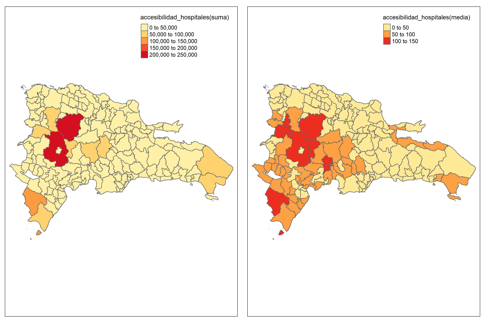
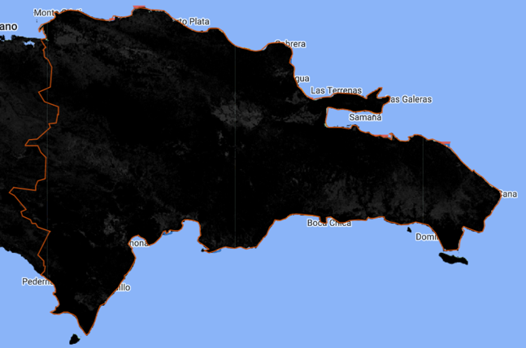
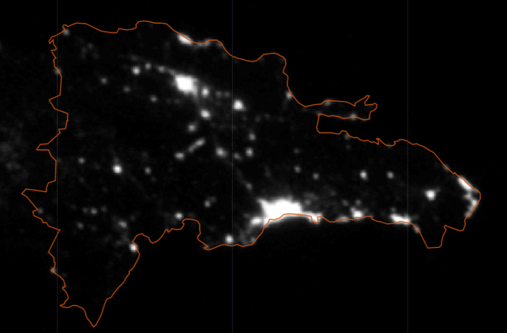
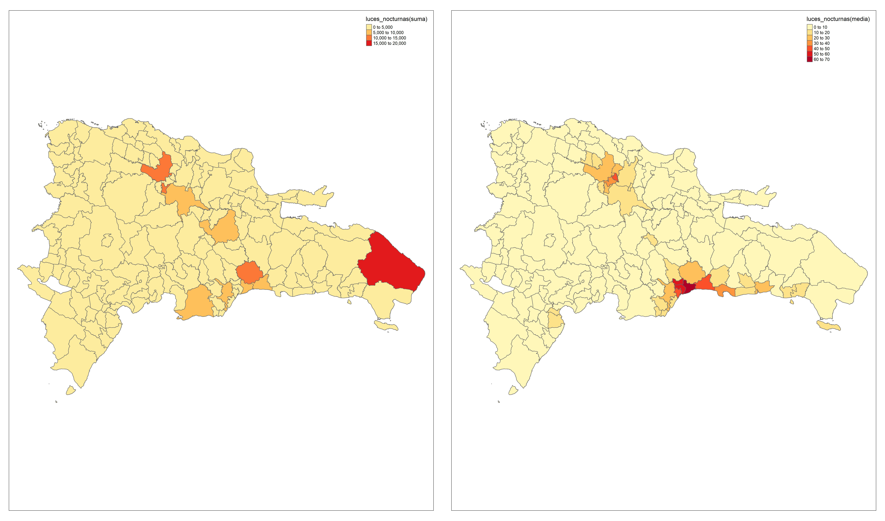

# Descarga de imágenes satelitales y validación de visual

La técnica de estimación de áreas pequeñas de Fay-Herriot, se basa en la combinación de información de una muestra de la población y de una fuente auxiliar, como las imágenes satelitales. Esta técnica se utiliza para mejorar la precisión de las estimaciones de áreas pequeñas, especialmente cuando la muestra de la población es limitada o no es representativa de la población completa.

Las imágenes satelitales pueden proporcionar información sobre características geográficas y ambientales de una zona, como la densidad de vegetación, el tipo de suelo, el uso del suelo, la topografía, entre otros. Esta información se puede utilizar para mejorar las estimaciones de las características de la población que se está estudiando.

La técnica Fay-Herriot es muy útil en áreas pequeñas donde la variabilidad de los datos es alta y la muestra es limitada. Las imágenes satelitales pueden ayudar a compensar la falta de información y proporcionar una fuente adicional de datos para mejorar las estimaciones.

## Librerias requeridas

Para llevar a cabo la descarga de imágenes satelitales, es necesario realizar un proceso previo que involucra la interconexión entre tres herramientas: R, Python y Google Earth Engine. Una vez configuradas estas herramientas, es posible obtener información desde Google Earth Engine utilizando R. Es importante destacar que, para llevar a cabo esta tarea, se requiere del uso de diversas librerías que se encargan de procesar y descargar la información necesaria. A continuación, se presentan las librerías imprescindibles para llevar a cabo este proceso de manera eficiente.


```r
library(tidyverse)   # Procesamiento de bases de datos.
library(magrittr)
library(reticulate)  # Conexión con Python
library(rgee)        # Conexión con Google Earth Engine
library(sf)          # Paquete para manejar datos geográficos
library(tmap)
library(sp)
library(concaveman)  # Colapso de polígonos dentro de un archivo shapefile. 
library(geojsonio)   # Requerido por rgee 
```

## Inicializando Google Earth Engine desde R

El proceso de la descarga de información de Google Earth Engine comienza con el inicio de sesión en Google Earth Engine desde R, para ello se debe ejecutar el siguiente bloque de código:


```r
rgee_environment_dir = "C://Users//sguerrero//Anaconda3//envs//rgee_py//python.exe"
reticulate::use_python(rgee_environment_dir, required = T)
```

donde **"C://Users//sguerrero//Anaconda3//envs//rgee_py//python.exe"** debe ser sustituido por la ruta donde creo el espacio de trabajo para **Python**. Ahora, a ejecutar la siguiente linea de código seleccione la opción *2*, para agilizar el proceso.


```r
rgee::ee_install_set_pyenv(py_path = rgee_environment_dir, py_env = "rgee_py")
```

Finalmente, al ejecutar el comando 'rgee::ee_Initialize(drive = T)', se inicia la conexión entre Google Earth Engine y R, lo que permite la descarga de imágenes satelitales. Con este paso completado, se está preparado para comenzar a trabajar con los datos satelitales disponibles en la plataforma.


```r
Sys.setenv(RETICULATE_PYTHON = rgee_environment_dir)
Sys.setenv(EARTHENGINE_PYTHON = rgee_environment_dir)
rgee::ee_Initialize(drive = T)
```

Sí todo ha salido bien, debería ver un resultado como el que muestra a continuación.

<div class="figure" style="text-align: center">

<p class="caption">(\#fig:unnamed-chunk-5)Inicializando Google Earth Engine</p>
</div>

## Descarga de información del Satélite a nivel distrito.

A continuación, se explicará el proceso de descarga de información satelital a nivel de distrito. Para comenzar, es necesario contar con un archivo **Shapefile**, el cual es un formato utilizado para almacenar información geoespacial. Este tipo de archivo contiene datos vectoriales tales como puntos, líneas y polígonos, junto con sus atributos asociados. En el siguiente bloque de código esta dividido en dos partes. La primera parte del código se encarga de leer el **Shapefile** que contiene los datos de los distritos, utilizando la función `read_sf` del paquete `sf`. El archivo se almacena en la variable `poligonos_distrito`.

La segunda parte del código extrae los parámetros de una imagen satelital mediante el uso del paquete `rgee`. La imagen es una colección de imágenes nocturnas llamada **NOAA/DMSP-OLS/NIGHTTIME_LIGHTS**. Se filtran las imágenes de un periodo particular ("2013-01-01" hasta "2014-01-01") y se selecciona una banda específica de la imagen ("stable_lights"). Luego, se utilizan las imágenes seleccionadas para generar una nueva banda de la imagen, que se almacena en la variable "luces".


```r
# Lectura del shapefile de los distritos. 
poligonos_distrito <- read_sf( "shapefiles2010/DMCenso2010.shp")

# Extrayendo los parámetros de la imagen satelital. 
luces <- ee$ImageCollection("NOAA/DMSP-OLS/NIGHTTIME_LIGHTS") %>%
  ee$ImageCollection$filterDate("2013-01-01", "2014-01-01") %>%
  ee$ImageCollection$map(function(x) x$select("stable_lights")) %>%
  ee$ImageCollection$toBands()
```

El proceso de obtención de la medida de resumen (media) de los pixeles de una imagen se realiza distrito por distrito. Para homologar los códigos de **Java** en **R**, se utiliza una sintaxis específica. Cabe mencionar que cada píxel de una imagen representa una porción de la misma, y contiene información sobre el color y el brillo de dicha porción. Por lo tanto, la obtención de la medida de resumen de los pixeles resulta fundamental para el análisis de la imagen en cuestión.


```r
DOM_luces_distrito <- map(unique(poligonos_distrito$ENLACE),
                 ~tryCatch(
                   ee_extract(
                   x = luces,
                   y = poligonos_distrito["ENLACE"] %>% filter(ENLACE == .x),
                   ee$Reducer$mean(),
                   sf = FALSE
                 ) %>% mutate(ENLACE = .x),
                 error = function(e)data.frame(ENLACE = .x)))
```

El código presentado utiliza la librería `purrr` de R para extraer la media de los valores que toma cada pixel de la imagen satelital que hacen referencia a la iluminación nocturna para cada distrito presente en una lista de polígonos. La función `map` aplica una función a cada distrito presente en `poligonos_distrito` que extrae la media de brillo de `stable_lights` para el polígono que corresponde al distrito en cuestión. La función `tryCatch` maneja posibles errores en la extracción de la media de brillo para cada distrito y retorna un `data.frame` con los valores extraídos y el nombre del distrito correspondiente.

Dado que la información fue extraída por separada para cada distrito. A continuación se muestra como se crea un `data.frame` a partir de la lista `DOM_luces_distrito`


```r
DOM_luces_distrito %<>% bind_rows()
```

Para obtener un mapa con los resultados obtenidos se ejecuta la sintaxis siguiente. Donde se realiza un `inner_join` entre las variables polígonos (`poligonos_distrito`) y la información satelital (`DOM_luces_distrito`). Con el resultado obtenido, es posible emplear la función `tm_shape` de la librería `tmap` para definir la variable  `map_dist` que contiene las características necesarias para desarrollar el mapa. Ahora, con la función `tm_polygons` se especifica la variable, el titulo y la paleta de colores que llevará el mapa. Por último, guarda el resultado obtenido con la función `tmap_save`.  
 

```r
poligonos_distrito <- inner_join(poligonos_distrito, DOM_luces_distrito)

map_dist <- tm_shape(poligonos_distrito)

map_dist <-
  map_dist + tm_polygons(
    "F182013_stable_lights",
    title = "Luces nocturnas(media)",
    palette = "YlOrRd"
  )
tmap_save(map_dist,
          "../map_temp/Luces nocturna distr.jpg",
          width = 3000,
          height = 2000,
          asp = 0
)
```

El mapa resultante se debe comparar con la información disponible en Google Earth Engine con el propósito de realizar una validación visual entre el imagen del satélite y la información descargada.


## Descarga de información Satélite a nivel municipal

Para descargar información satelital del municipio, se sigue un proceso similar al utilizado para descargar información de los distritos, aunque con algunas variaciones en la sintaxis que dependen del tipo de información satelital que se esté obteniendo. Cabe mencionar que las variaciones en la sintaxis se deben a las particularidades de cada tipo de información satelital y no afectan significativamente el proceso de descarga de la misma. Cabe mencionar que, para cada una de las variables satelitales se emplea como medida de resumen la media y la suma.

### Luces nocturnas

Siguiendo los pasos realizados para el distrito, se hace la lectura del shapefile para los municipio.


```r
poligonos_minucipio <- read_sf( "../shapefiles2010/MUNCenso2010.shp")
```

#### Medida de resumen la media
Note que, el cambio en el código es la variable  `poligonos_distrito` que es sustituida por `poligonos_minucipio`, de esta forma obtenemos las medidas de resumen por municipios. Además, se incluye una linea de código para guardar los resultados en un archivo de formato  `.rds`.


```r
DOM_luces <- map(unique(poligonos_minucipio$ENLACE),
                 ~tryCatch(ee_extract(
                   x = luces,
                   y = poligonos_minucipio["ENLACE"] %>% filter(ENLACE == .x),
                   ee$Reducer$mean(),
                   sf = FALSE
                 ) %>% mutate(ENLACE = .x),
                 error = function(e)data.frame(ENLACE = .x)))

DOM_luces %<>% bind_rows() %>% 
  saveRDS("map_temp/data/temp_luces_mean.rds")
```

#### Medida de resumen suma

En el proceso de la suma la variación del código se presenta en la función de resumen, dado que es sustituido `ee$Reducer$mean()` por ` ee$Reducer$sum()`, de esta forma se obtiene la suma de los valores de los pixeles dentro del polígono del municipio. 


```r
DOM_luces <- map(unique(poligonos_minucipio$ENLACE),
                 ~tryCatch(ee_extract(
                   x = luces,
                   y = poligonos_minucipio["ENLACE"] %>% filter(ENLACE == .x),
                   ee$Reducer$sum(),
                   sf = FALSE
                 ) %>% mutate(ENLACE = .x),
                 error = function(e)data.frame(ENLACE = .x)))

DOM_luces %<>% bind_rows() %>% 
  saveRDS("map_temp/data/temp_luces_sum.rds")
```

## Cubrimiento de suelo urbano y cubrimiento de suelo cultivos

La siguiente imagen que se procesa corresponde al cubrimiento urbano y cubrimiento cultivos, para acceder a la información satelital se procede con la función `ee$ImageCollection()`, y se filtra por fecha con la función `ee$ImageCollection$filterDate()`. La información satelital se procesa con la función `ee$ImageCollection$map()`, que permite aplicar una función de resumen a cada imagen satelital presente en la colección. En este caso, se utiliza la función `select()` para seleccionar únicamente las bandas correspondientes cubrimiento de suelo urbano y al cubrimiento de suelos cultivos. Finalmente, se fusionan las imágenes satelitales resultantes en un único raster con la función `ee$ImageCollection$toBands()`. 


```r
tiposuelo = ee$ImageCollection("COPERNICUS/Landcover/100m/Proba-V-C3/Global") %>%
  ee$ImageCollection$filterDate("2016-01-01", "2016-12-31") %>%
  ee$ImageCollection$map(function(x) x$select("urban-coverfraction", "crops-coverfraction")) %>% 
  ee$ImageCollection$toBands()
```

### Medida de resumen la media

Dado que se cambio la fuente de información,es necesario realizar la actualización del código, para este caso cambiamos la variable `luces` por la variable `tiposuelo` y conservamos como medida de resumen la media. 


```r
DOM_suelo <- map(unique(poligonos_minucipio$ENLACE),
                 ~tryCatch(ee_extract(
                   x = tiposuelo,
                   y = poligonos_minucipio["ENLACE"] %>% 
                     filter(ENLACE == .x),
                   ee$Reducer$mean(),
                   sf = FALSE
                 ) %>% mutate(ENLACE = .x),
                 error = function(e)data.frame(ENLACE = .x)))

DOM_suelo %>% bind_rows() %>% 
  saveRDS("../map_temp/data/temp_suelo_mean.rds")
```

### Medida de resumen suma
Continuando el procesamiento de la variable `tiposuelo`, ahora se realiza la descarga empleando como medida de resumen la suma. 

```r
DOM_suelo <- map(unique(poligonos_minucipio$ENLACE),
                 ~tryCatch(ee_extract(
                   x = tiposuelo,
                   y = poligonos_minucipio["ENLACE"] %>% 
                     filter(ENLACE == .x),
                   ee$Reducer$sum(),
                   sf = FALSE
                 ) %>% mutate(ENLACE = .x),
                 error = function(e)data.frame(ENLACE = .x)))

DOM_suelo %>% bind_rows() %>% 
  saveRDS("map_temp/data/temp_suelo_suma.rds")
```
el procesamiento anterior regresa un `data.frame` con tres columnas, el ENLACE, que corresponde al código del municipio, X2016_crops.coverfraction y X2016_urban.coverfraction. 

## Distancia a hospitales

Este conjunto de datos se basa en modelos de accesibilidad que se construyen a partir de información sobre la infraestructura de la atención médica y la geografía del terreno. Los modelos se basan en el tiempo de viaje esperado entre diferentes áreas geográficas y los diferentes tipos de instalaciones médicas, como hospitales, clínicas y consultorios médicos.


```r
dist_salud = ee$Image('Oxford/MAP/accessibility_to_healthcare_2019') 
```

### Medida de resumen la media

Ahora, la medida de resumen es la media y el proceso es igual a los descritos previamente, la variación de los códigos en la fuente de información. 


```r
DOM_dist_salud <- map(unique(poligonos_minucipio$ENLACE),
                 ~tryCatch(ee_extract(
                   x = dist_salud,
                   y = poligonos_minucipio["ENLACE"] %>% filter(ENLACE == .x),
                   ee$Reducer$mean(),
                   sf = FALSE
                 ) %>% mutate(ENLACE = .x),
                 error = function(e)data.frame(ENLACE = .x)))

DOM_dist_salud %>% bind_rows() %>% 
  saveRDS("map_temp/data/temp_salud_mean.rds")
```

### Medida de resumen suma


```r
DOM_dist_salud <- map(unique(poligonos_minucipio$ENLACE),
                      ~tryCatch(ee_extract(
                        x = dist_salud,
                        y = poligonos_minucipio["ENLACE"] %>% filter(ENLACE == .x),
                        ee$Reducer$sum(),
                        sf = FALSE
                      ) %>% mutate(ENLACE = .x),
                      error = function(e)data.frame(ENLACE = .x)))

DOM_dist_salud %>% bind_rows() %>% 
  saveRDS("map_temp/data/temp_salud_suma.rds")
```

## CSP gHM: Global Human Modification

Este conjunto de datos muestra la escala y el impacto de la influencia humana en la superficie terrestre, a través de la recopilación y análisis de varios indicadores relacionados con la actividad humana, como la infraestructura construida, el uso del suelo, la densidad de población y la urbanización.

La escala del conjunto de datos es de 1 kilómetro cuadrado y se extiende a nivel mundial, proporcionando una visión general de la modificación humana en diferentes áreas del mundo. El conjunto de datos se actualiza regularmente para reflejar los cambios en la modificación humana en el tiempo.


```r
CSP_gHM = ee$ImageCollection('CSP/HM/GlobalHumanModification') 
```

### Medida de resumen la media

Como es habitual se hace la modificación del código para la variable `CSP_gHM`. 


```r
DOM_CSP_gHM <- map(unique(poligonos_minucipio$ENLACE),
                      ~tryCatch(ee_extract(
                        x = CSP_gHM,
                        y = poligonos_minucipio["ENLACE"] %>% filter(ENLACE == .x),
                        ee$Reducer$mean(),
                        sf = FALSE
                      ) %>% mutate(ENLACE = .x),
                      error = function(e)data.frame(id_municipio = .x)))

DOM_CSP_gHM %>% bind_rows() %>% 
  saveRDS("map_temp/data/temp_gHM_mean.rds")
```

### Medida de resumen suma


```r
DOM_CSP_gHM <- map(unique(poligonos_minucipio$ENLACE),
                   ~tryCatch(ee_extract(
                     x = CSP_gHM,
                     y = poligonos_minucipio["ENLACE"] %>% filter(ENLACE == .x),
                     ee$Reducer$sum(),
                     sf = FALSE
                   ) %>% mutate(ENLACE = .x),
                   error = function(e)data.frame(id_municipio = .x)))

DOM_CSP_gHM %>% bind_rows() %>% 
  saveRDS("map_temp/data/temp_gHM_suma.rds")
```

## Consolidando las variables satelitales

Una vez que se han descargado y almacenado todas las variables satelitales en archivos '.rds', es necesario consolidarlos en un único archivo para poder realizar el análisis. Para ello, se utiliza el código siguiente que combina las variables satelitales en un `data.frame`, para la media y la suma por separado. Además, el código también renombra las variables para hacerlas más descriptivas y fáciles de entender. En este caso se renombran variables como "luces_nocturnas", _cubrimiento_cultivo_, _cubrimiento_urbano_, _accesibilidad_hospitales_, _accesibilidad_hosp_caminado_ y _modificacion_humana_ para reflejar de manera más clara los datos que representan. Una vez completada la consolidación, se puede comenzar a analizar los datos de manera más detallada.

### Medida de resumen la media


```r
satelital_promedio <- reduce(list(
readRDS("../map_temp/data/temp_gHM_mean.rds"),
readRDS("../map_temp/data/temp_salud_mean.rds"),
readRDS("../map_temp/data/temp_suelo_mean.rds"),
readRDS("../map_temp/data/temp_luces_mean.rds")), inner_join) %>% 
  rename(
    luces_nocturnas = F182013_stable_lights,
    cubrimiento_cultivo = X2016_crops.coverfraction,
    cubrimiento_urbano = X2016_urban.coverfraction,
    accesibilidad_hospitales = accessibility,
    accesibilidad_hosp_caminado = accessibility_walking_only,
    modificacion_humana = X2016_gHM)

tba(head(satelital_promedio, 15))
```

<table class="table table-striped lightable-classic" style="width: auto !important; margin-left: auto; margin-right: auto; font-family: Arial Narrow; width: auto !important; margin-left: auto; margin-right: auto;">
 <thead>
  <tr>
   <th style="text-align:left;"> ENLACE </th>
   <th style="text-align:right;"> modificacion_humana </th>
   <th style="text-align:right;"> accesibilidad_hospitales </th>
   <th style="text-align:right;"> accesibilidad_hosp_caminado </th>
   <th style="text-align:right;"> cubrimiento_cultivo </th>
   <th style="text-align:right;"> cubrimiento_urbano </th>
   <th style="text-align:right;"> luces_nocturnas </th>
  </tr>
 </thead>
<tbody>
  <tr>
   <td style="text-align:left;"> 100101 </td>
   <td style="text-align:right;"> 0.8512 </td>
   <td style="text-align:right;"> 0.6314 </td>
   <td style="text-align:right;"> 8.2032 </td>
   <td style="text-align:right;"> 0.4969 </td>
   <td style="text-align:right;"> 82.3803 </td>
   <td style="text-align:right;"> 61.6816 </td>
  </tr>
  <tr>
   <td style="text-align:left;"> 050201 </td>
   <td style="text-align:right;"> 0.3896 </td>
   <td style="text-align:right;"> 52.3864 </td>
   <td style="text-align:right;"> 168.3625 </td>
   <td style="text-align:right;"> 8.0452 </td>
   <td style="text-align:right;"> 3.9507 </td>
   <td style="text-align:right;"> 5.4292 </td>
  </tr>
  <tr>
   <td style="text-align:left;"> 050202 </td>
   <td style="text-align:right;"> 0.3493 </td>
   <td style="text-align:right;"> 38.2478 </td>
   <td style="text-align:right;"> 162.7940 </td>
   <td style="text-align:right;"> 6.1779 </td>
   <td style="text-align:right;"> 1.6302 </td>
   <td style="text-align:right;"> 2.4353 </td>
  </tr>
  <tr>
   <td style="text-align:left;"> 050203 </td>
   <td style="text-align:right;"> 0.2800 </td>
   <td style="text-align:right;"> 56.4654 </td>
   <td style="text-align:right;"> 136.7688 </td>
   <td style="text-align:right;"> 4.2257 </td>
   <td style="text-align:right;"> 0.5977 </td>
   <td style="text-align:right;"> 0.9202 </td>
  </tr>
  <tr>
   <td style="text-align:left;"> 050204 </td>
   <td style="text-align:right;"> 0.2309 </td>
   <td style="text-align:right;"> 73.5606 </td>
   <td style="text-align:right;"> 189.4570 </td>
   <td style="text-align:right;"> 4.5242 </td>
   <td style="text-align:right;"> 0.5840 </td>
   <td style="text-align:right;"> 0.4475 </td>
  </tr>
  <tr>
   <td style="text-align:left;"> 050205 </td>
   <td style="text-align:right;"> 0.3025 </td>
   <td style="text-align:right;"> 105.4853 </td>
   <td style="text-align:right;"> 260.1237 </td>
   <td style="text-align:right;"> 4.0241 </td>
   <td style="text-align:right;"> 1.1075 </td>
   <td style="text-align:right;"> 0.5929 </td>
  </tr>
  <tr>
   <td style="text-align:left;"> 050206 </td>
   <td style="text-align:right;"> 0.4615 </td>
   <td style="text-align:right;"> 33.5826 </td>
   <td style="text-align:right;"> 133.0851 </td>
   <td style="text-align:right;"> 14.9559 </td>
   <td style="text-align:right;"> 3.4069 </td>
   <td style="text-align:right;"> 2.6681 </td>
  </tr>
  <tr>
   <td style="text-align:left;"> 050207 </td>
   <td style="text-align:right;"> 0.6151 </td>
   <td style="text-align:right;"> 13.9386 </td>
   <td style="text-align:right;"> 105.5657 </td>
   <td style="text-align:right;"> 12.0439 </td>
   <td style="text-align:right;"> 4.0286 </td>
   <td style="text-align:right;"> 7.1367 </td>
  </tr>
  <tr>
   <td style="text-align:left;"> 050208 </td>
   <td style="text-align:right;"> 0.3218 </td>
   <td style="text-align:right;"> 48.4565 </td>
   <td style="text-align:right;"> 134.1144 </td>
   <td style="text-align:right;"> 5.3874 </td>
   <td style="text-align:right;"> 1.4284 </td>
   <td style="text-align:right;"> 1.8673 </td>
  </tr>
  <tr>
   <td style="text-align:left;"> 050209 </td>
   <td style="text-align:right;"> 0.2043 </td>
   <td style="text-align:right;"> 134.2056 </td>
   <td style="text-align:right;"> 324.6904 </td>
   <td style="text-align:right;"> 2.6433 </td>
   <td style="text-align:right;"> 0.3586 </td>
   <td style="text-align:right;"> 0.0286 </td>
  </tr>
  <tr>
   <td style="text-align:left;"> 050210 </td>
   <td style="text-align:right;"> 0.2702 </td>
   <td style="text-align:right;"> 56.6110 </td>
   <td style="text-align:right;"> 173.5820 </td>
   <td style="text-align:right;"> 4.6026 </td>
   <td style="text-align:right;"> 0.5170 </td>
   <td style="text-align:right;"> 1.6565 </td>
  </tr>
  <tr>
   <td style="text-align:left;"> 060301 </td>
   <td style="text-align:right;"> 0.4137 </td>
   <td style="text-align:right;"> 56.5053 </td>
   <td style="text-align:right;"> 254.6072 </td>
   <td style="text-align:right;"> 9.3719 </td>
   <td style="text-align:right;"> 2.8411 </td>
   <td style="text-align:right;"> 4.0678 </td>
  </tr>
  <tr>
   <td style="text-align:left;"> 060302 </td>
   <td style="text-align:right;"> 0.3323 </td>
   <td style="text-align:right;"> 46.2911 </td>
   <td style="text-align:right;"> 247.5742 </td>
   <td style="text-align:right;"> 4.5119 </td>
   <td style="text-align:right;"> 1.1275 </td>
   <td style="text-align:right;"> 1.7294 </td>
  </tr>
  <tr>
   <td style="text-align:left;"> 060303 </td>
   <td style="text-align:right;"> 0.3136 </td>
   <td style="text-align:right;"> 58.1096 </td>
   <td style="text-align:right;"> 259.7428 </td>
   <td style="text-align:right;"> 8.3016 </td>
   <td style="text-align:right;"> 1.2898 </td>
   <td style="text-align:right;"> 2.1443 </td>
  </tr>
  <tr>
   <td style="text-align:left;"> 060304 </td>
   <td style="text-align:right;"> 0.3264 </td>
   <td style="text-align:right;"> 84.6066 </td>
   <td style="text-align:right;"> 396.0371 </td>
   <td style="text-align:right;"> 2.4981 </td>
   <td style="text-align:right;"> 2.1171 </td>
   <td style="text-align:right;"> 1.5881 </td>
  </tr>
</tbody>
</table>

### Medida de resumen suma


```r
satelital_suma <- reduce(list(
  readRDS("../map_temp/data/temp_gHM_suma.rds"),
  readRDS("../map_temp/data/temp_salud_suma.rds"),
  readRDS("../map_temp/data/temp_suelo_suma.rds"),
  readRDS("../map_temp/data/temp_luces_sum.rds")), inner_join) %>% 
  rename(
    luces_nocturnas = F182013_stable_lights,
    cubrimiento_cultivo = X2016_crops.coverfraction,
    cubrimiento_urbano = X2016_urban.coverfraction,
    accesibilidad_hospitales = accessibility,
    accesibilidad_hosp_caminado = accessibility_walking_only,
    modificacion_humana = X2016_gHM)
tba(head(satelital_suma, 15))
```

<table class="table table-striped lightable-classic" style="width: auto !important; margin-left: auto; margin-right: auto; font-family: Arial Narrow; width: auto !important; margin-left: auto; margin-right: auto;">
 <thead>
  <tr>
   <th style="text-align:left;"> ENLACE </th>
   <th style="text-align:right;"> modificacion_humana </th>
   <th style="text-align:right;"> accesibilidad_hospitales </th>
   <th style="text-align:right;"> accesibilidad_hosp_caminado </th>
   <th style="text-align:right;"> cubrimiento_cultivo </th>
   <th style="text-align:right;"> cubrimiento_urbano </th>
   <th style="text-align:right;"> luces_nocturnas </th>
  </tr>
 </thead>
<tbody>
  <tr>
   <td style="text-align:left;"> 100101 </td>
   <td style="text-align:right;"> 82.5124 </td>
   <td style="text-align:right;"> 57.4419 </td>
   <td style="text-align:right;"> 746.2627 </td>
   <td style="text-align:right;"> 50.6941 </td>
   <td style="text-align:right;"> 8405.0510 </td>
   <td style="text-align:right;"> 5983.3569 </td>
  </tr>
  <tr>
   <td style="text-align:left;"> 050201 </td>
   <td style="text-align:right;"> 171.3378 </td>
   <td style="text-align:right;"> 22531.8859 </td>
   <td style="text-align:right;"> 72414.3451 </td>
   <td style="text-align:right;"> 3716.1412 </td>
   <td style="text-align:right;"> 1824.8588 </td>
   <td style="text-align:right;"> 2393.9961 </td>
  </tr>
  <tr>
   <td style="text-align:left;"> 050202 </td>
   <td style="text-align:right;"> 91.2574 </td>
   <td style="text-align:right;"> 9832.0875 </td>
   <td style="text-align:right;"> 41848.2706 </td>
   <td style="text-align:right;"> 1694.9412 </td>
   <td style="text-align:right;"> 447.2667 </td>
   <td style="text-align:right;"> 636.1412 </td>
  </tr>
  <tr>
   <td style="text-align:left;"> 050203 </td>
   <td style="text-align:right;"> 127.9557 </td>
   <td style="text-align:right;"> 25805.5575 </td>
   <td style="text-align:right;"> 62505.4706 </td>
   <td style="text-align:right;"> 2037.2706 </td>
   <td style="text-align:right;"> 288.1608 </td>
   <td style="text-align:right;"> 420.5569 </td>
  </tr>
  <tr>
   <td style="text-align:left;"> 050204 </td>
   <td style="text-align:right;"> 140.4386 </td>
   <td style="text-align:right;"> 44815.7165 </td>
   <td style="text-align:right;"> 115423.8745 </td>
   <td style="text-align:right;"> 2912.0353 </td>
   <td style="text-align:right;"> 375.8863 </td>
   <td style="text-align:right;"> 272.5804 </td>
  </tr>
  <tr>
   <td style="text-align:left;"> 050205 </td>
   <td style="text-align:right;"> 41.4888 </td>
   <td style="text-align:right;"> 14465.5526 </td>
   <td style="text-align:right;"> 35671.6275 </td>
   <td style="text-align:right;"> 582.4549 </td>
   <td style="text-align:right;"> 160.3020 </td>
   <td style="text-align:right;"> 81.3137 </td>
  </tr>
  <tr>
   <td style="text-align:left;"> 050206 </td>
   <td style="text-align:right;"> 55.5381 </td>
   <td style="text-align:right;"> 4050.7147 </td>
   <td style="text-align:right;"> 16052.6667 </td>
   <td style="text-align:right;"> 1897.8784 </td>
   <td style="text-align:right;"> 432.3294 </td>
   <td style="text-align:right;"> 321.6784 </td>
  </tr>
  <tr>
   <td style="text-align:left;"> 050207 </td>
   <td style="text-align:right;"> 31.3481 </td>
   <td style="text-align:right;"> 703.2686 </td>
   <td style="text-align:right;"> 5326.3059 </td>
   <td style="text-align:right;"> 646.2588 </td>
   <td style="text-align:right;"> 216.1686 </td>
   <td style="text-align:right;"> 363.6078 </td>
  </tr>
  <tr>
   <td style="text-align:left;"> 050208 </td>
   <td style="text-align:right;"> 93.6305 </td>
   <td style="text-align:right;"> 14104.8195 </td>
   <td style="text-align:right;"> 39038.3216 </td>
   <td style="text-align:right;"> 1653.1882 </td>
   <td style="text-align:right;"> 438.3294 </td>
   <td style="text-align:right;"> 543.3216 </td>
  </tr>
  <tr>
   <td style="text-align:left;"> 050209 </td>
   <td style="text-align:right;"> 51.0529 </td>
   <td style="text-align:right;"> 33551.4108 </td>
   <td style="text-align:right;"> 81172.5922 </td>
   <td style="text-align:right;"> 697.5176 </td>
   <td style="text-align:right;"> 94.6353 </td>
   <td style="text-align:right;"> 7.1373 </td>
  </tr>
  <tr>
   <td style="text-align:left;"> 050210 </td>
   <td style="text-align:right;"> 61.0249 </td>
   <td style="text-align:right;"> 12601.1716 </td>
   <td style="text-align:right;"> 38637.9882 </td>
   <td style="text-align:right;"> 1095.7882 </td>
   <td style="text-align:right;"> 123.0863 </td>
   <td style="text-align:right;"> 374.0510 </td>
  </tr>
  <tr>
   <td style="text-align:left;"> 060301 </td>
   <td style="text-align:right;"> 123.7160 </td>
   <td style="text-align:right;"> 16886.6670 </td>
   <td style="text-align:right;"> 76089.6196 </td>
   <td style="text-align:right;"> 2952.5961 </td>
   <td style="text-align:right;"> 895.0941 </td>
   <td style="text-align:right;"> 1215.5412 </td>
  </tr>
  <tr>
   <td style="text-align:left;"> 060302 </td>
   <td style="text-align:right;"> 99.1125 </td>
   <td style="text-align:right;"> 13793.4891 </td>
   <td style="text-align:right;"> 73770.3098 </td>
   <td style="text-align:right;"> 1418.2078 </td>
   <td style="text-align:right;"> 354.4157 </td>
   <td style="text-align:right;"> 515.6078 </td>
  </tr>
  <tr>
   <td style="text-align:left;"> 060303 </td>
   <td style="text-align:right;"> 144.3256 </td>
   <td style="text-align:right;"> 26755.0105 </td>
   <td style="text-align:right;"> 119591.6784 </td>
   <td style="text-align:right;"> 4030.1922 </td>
   <td style="text-align:right;"> 626.1412 </td>
   <td style="text-align:right;"> 987.0039 </td>
  </tr>
  <tr>
   <td style="text-align:left;"> 060304 </td>
   <td style="text-align:right;"> 44.6838 </td>
   <td style="text-align:right;"> 12292.1785 </td>
   <td style="text-align:right;"> 57538.7490 </td>
   <td style="text-align:right;"> 382.9333 </td>
   <td style="text-align:right;"> 324.5333 </td>
   <td style="text-align:right;"> 230.7216 </td>
  </tr>
</tbody>
</table>

Por último, se guarda el archivo que contiene las dos medidas de resumen en un nuevo '.rds'


```r
inner_join(
  satelital_promedio,
  satelital_suma,
  by = "ENLACE",
  suffix = c("_promedio", "_suma")
) %>%
  saveRDS("../Data/auxiliar_satelital.Rds")
```

## Creando mapas de las variables satelitales

Durante el proceso de validación del modelo, es fundamental la comparación de los mapas generados con las imágenes disponibles en Google Earth Engine. Para llevar a cabo esta tarea, es necesario realizar la unión entre los polígonos (shapefile) y las `data.frame` que contienen las variables satelitales. En este sentido, se utiliza el código presentado a continuación para crear los dos objetos: `poligonos_promedio` y `poligonos_suma`.


```r
poligonos_promedio <- read_sf( "../shapefiles2010/MUNCenso2010.shp")%>%
  dplyr::select(ENLACE) %>% inner_join(satelital_promedio) 

poligonos_suma <- read_sf( "../shapefiles2010/MUNCenso2010.shp") %>%
 dplyr::select(ENLACE) %>% inner_join(satelital_suma)
```

El objeto `poligonos_promedio` se genera a partir del shapefile de los municipios y la información de las variables satelitales que se han promediado. Por otro lado, el objeto `poligonos_suma` se construye de manera similar, pero utilizando la información de las variables satelitales que se han sumado.

El siguiente paso es crear los objeto `m1` y `m2`, para lo cual usamos la función `tm_shape` de la librería `tmap`.


```r
m1 <- tm_shape(poligonos_suma)
m2 <- tm_shape(poligonos_promedio)
```
Para crear los mapas se utiliza una sintaxis similar para cada variable, por lo que se haces pocas modificaciones entre los bloques de código. 

### Modificacion humana

El presente código genera dos mapas utilizando la librería `tmap` de R. Primero, establece algunas opciones con `tmap_options(check.and.fix = TRUE)` para verificar y corregir posibles errores.

Luego, se crean dos objetos de mapa `m1_modificacion_humana` y `m2_modificacion_humana`, que muestran la variable __modificacion_humana__ en dos formas diferentes: la suma y el promedio. Cada uno de los mapas utiliza `tm_polygons()` para representar los polígonos del mapa y las variables correspondientes. También establece un título para cada mapa con `title` y una paleta de colores con `palette`.

Finalmente, utiliza `tmap_arrange()` para combinar los dos mapas en una cuadrícula de dos columnas (ncol = 2) y una fila (nrow = 1), y lo guarda en el objeto `map_modificacion_humana`. Al final se muestra el mapa combinado. 


```r
tmap_options(check.and.fix = TRUE)
m1_modificacion_humana<-
  m1 + tm_polygons(
    "modificacion_humana",
    title = "modificacion_humana(suma)",
    palette = "YlOrRd"
  )

m2_modificacion_humana <-
  m2 + tm_polygons(
    "modificacion_humana",
    title = "modificacion_humana(media)",
    palette = "YlOrRd"
  )

map_modificacion_humana <- tmap_arrange(list(m1_modificacion_humana,
                                             m2_modificacion_humana),
                                                ncol = 2,
                                                norw = 1)
```

El último paso es guardar el mapa resultante, para este fin se utiliza la sintaxis.


```r
tmap_save(map_modificacion_humana,
          "../map_temp/modificacion_humana.jpg",
          width = 3000,
          height = 2000,
          asp = 0
)
```

A continuación se presenta un comparativo entre la información obtenida en Google Earth Engine y la procesada en R, donde se puede apreciar que el uso del promedio de los pixeles es una medida de resumen más adecuada, ya que refleja de mejor manera la información capturada por el satélite. Es importante destacar que esta comparación es esencial para validar el proceso de procesamiento de las variables satelitales, ya que permite verificar que la información obtenida en R se asemeje a la imagen de referencia disponible en Google Earth Engine. De esta manera, se asegura que la información procesada sea lo más cercana posible a la realidad y se evita la toma de decisiones basadas en información errónea. 


### Accesibilidad hospitales caminado

Para obtener el mapa correspondiente a la variable _accesibilidad_hosp_caminado_, se sigue un proceso similar al descrito anteriormente. En primer lugar, se crean los objetos `m1_accesibilidad_hosp_caminado` y `m2_accesibilidad_hosp_caminado` utilizando la función `tm_shape` y `tm_polygons` de la librería `tmap`, respectivamente. Estos objetos se unen en el objeto `map_accesibilidad_hosp_caminado` utilizando la función `tmap_arrange` para mostrar ambas visualizaciones en una misma imagen.

Finalmente, se utiliza la función `tmap_save` para guardar la imagen resultante en formato PNG. De esta manera, se obtiene un mapa que muestra la accesibilidad a hospitales caminando.


```r
m1_accesibilidad_hosp_caminado<-
  m1 + tm_polygons(
    "accesibilidad_hosp_caminado",
    title = "accesibilidad_hosp_caminado(suma)",
    palette = "YlOrRd"
  )

m2_accesibilidad_hosp_caminado <-
  m2 + tm_polygons(
    "accesibilidad_hosp_caminado",
    title = "accesibilidad_hosp_caminado(media)",
    palette = "YlOrRd"
  )

map_accesibilidad_hosp_caminado <-
  tmap_arrange(
    list(
      m1_accesibilidad_hosp_caminado,
      m2_accesibilidad_hosp_caminado
    ),
    ncol = 2,
    norw = 1
  )
tmap_save(map_accesibilidad_hosp_caminado,
          "../map_temp/accesibilidad_hosp_caminado.jpg",
          width = 3000,
          height = 2000,
          asp = 0
)
```

La imagen satelital de la variable `accesibilidad_hosp_caminado` proporciona información sobre los tiempos promedio que una persona tarda en llegar a un hospital o clínica. En la escala de grises utilizada para la gráfica, los tonos más oscuros indican tiempos menores, mientras que los tonos más claros indican tiempos mayores. Al observar la imagen, podemos confirmar que el promedio sigue siendo la medida de resumen que mejor refleja la información capturada por el satélite.


## Accesibilidad hospitales

La variable `accesibilidad_hospitales` mide el tiempo promedio que una persona tarda en llegar a clínicas u hospitales, independientemente del medio de transporte utilizado. Como esta variable utiliza la misma fuente de datos que `accesibilidad_hosp_caminado`, su interpretación visual en escala de grises es similar, donde los tonos más oscuros indican tiempos menores y los tonos más claros, tiempos mayores.

Después de observar la imagen, se puede confirmar que el promedio sigue siendo la medida de resumen que mejor refleja la información capturada por el satélite. Para obtener el mapa correspondiente a `accesibilidad_hospitales`, se sigue un proceso similar al descrito previamente: se crean los objetos `m1_accesibilidad_hospitales` y `m2_accesibilidad_hospitales` utilizando `tm_shape` y `tm_polygons` de la librería `tmap`, respectivamente. Luego, se unen en el objeto `map_accesibilidad_hospitales` utilizando `tmap_arrange` para mostrar ambas visualizaciones en una misma imagen. Finalmente, se utiliza `tmap_save` para guardar la imagen resultante en formato PNG. De esta manera, se obtiene un mapa que muestra la accesibilidad a hospitales en la zona de estudio.


```r
m1_accesibilidad_hospitales <-
  m1 + tm_polygons(
    "accesibilidad_hospitales",
    title = "accesibilidad_hospitales(suma)",
    palette = "YlOrRd"
  )

m2_accesibilidad_hospitales <-
  m2 + tm_polygons(
    "accesibilidad_hospitales",
    title = "accesibilidad_hospitales(media)",
    palette = "YlOrRd"
  )


map_accesibilidad_hospitales <-
  tmap_arrange(
    list(m1_accesibilidad_hospitales,
         m2_accesibilidad_hospitales),
    ncol = 2,
    norw = 1
  )

tmap_save(map_accesibilidad_hospitales,
          "../map_temp/accesibilidad_hospitales.jpg",
          width = 3000,
          height = 2000,
          asp = 0
)
```



## Cubrimiento urbano

La imagen satelital representa el cubrimiento urbano, en una escala de tonos que va desde el negro, que indica ausencia de construcciones urbanas, hasta el blanco, que representa la presencia de edificaciones. Esta variable es relevante porque permite identificar las zonas con mayor densidad de población.

Sin embargo, al procesar los datos, se observó que la variable tiene un comportamiento asimétrico y la escala utilizada para representarla no es adecuada para mostrar los detalles más finos de la imagen. Para superar este problema y validar la información obtenida a través de la descarga de datos, se decidió aplicar una transformación logarítmica a la variable. En el siguiente bloque de código se describe el proceso detalladamente para obtener el mapa correspondiente.


```r
m1 <-
  tm_shape(poligonos_suma %>% 
             mutate(cubrimiento_urbano = log(cubrimiento_urbano + 1)))
m2 <-
  tm_shape(poligonos_promedio %>%
             mutate(cubrimiento_urbano = log(cubrimiento_urbano + 1)))

m1_cubrimiento_urbano <-
  m1 + tm_polygons(
    "cubrimiento_urbano",
    title = "cubrimiento_urbano(suma)",
    palette = "YlOrRd"
  )

m2_cubrimiento_urbano <-
  m2 + tm_polygons(
    "cubrimiento_urbano",
    title = "cubrimiento_urbano(media)",
    palette = "YlOrRd"
  )

map_cubrimiento_urbano <- tmap_arrange(
  list(m1_cubrimiento_urbano,
       m2_cubrimiento_urbano),
  ncol = 2,
  norw = 1
)

tmap_save(map_cubrimiento_urbano,
          "../map_temp/cubrimiento_urbano.jpg",
          width = 3000,
          height = 2000,
          asp = 0
)
```

Como se puede notar la modificación realizada consistió en definir nuevamente los objetos `m1` y `m2`, donde incluimos la transformación logarítmica mediante el comando ` mutate(cubrimiento_urbano = log(cubrimiento_urbano + 1))`. Es de mencionar, que para la variable original se le suma la constante `uno` para corregir errores del calculo, en caso que la variable posea un valor de `cero`. Ahora, al realizar la comparación entre las dos imágenes podemos  vemos que la media, como medida de resumen muestra una mayor similitud con la mostrada del satélite.  

Como se puede notar, la modificación realizada en el código, en la cual se incluyó la transformación logarítmica de la variable `cubrimiento_urbano` para obtener un mapa que muestre una mejor correspondencia con la imagen satelital original. En primer lugar, se crearon nuevamente los objetos `m1` y `m2` utilizando el comando `tm_shape`. A continuación, se aplicó la transformación logarítmica mediante el comando `mutate(cubrimiento_urbano = log(cubrimiento_urbano + 1))`, donde se suma una constante de `uno` para evitar errores en el cálculo en caso de que la variable tenga un valor de `cero`.

Al comparar la imagen obtenida mediante la transformación logarítmica con la imagen satelital original, no es claro cual de las dos imágenes representa de mejor forma la información capturada por el satélite. Dado que, las dos imágenes muestran valores altos en las ciudades principales, sin embargo, la figura de la suma muestra unos municipios en naranja que nos son reflejados por la gráfica obtenida con el promedio.  


## Cubrimiento cultivo

La variable `cubrimiento_cultivo` proporciona información sobre las áreas de cultivo presentes en los municipios y su interpretación visual en la imagen satelital es similar a las variables analizadas anteriormente. Los tonos más oscuros indican baja presencia de cultivos, mientras que los tonos más claros indican mayor presencia de cultivos.

Para poder comparar la información de esta variable con la mostrada por Google Earth Engine, fue necesario aplicar una transformación logarítmica, similar a la realizada en la variable `cubrimiento_urbano.` El objetivo de esta transformación fue facilitar la comparación entre ambas fuentes de información. Al comparar las dos imágenes, no se observa una clara diferencia en cuanto a cuál medida de resumen sería más adecuada, pero se opta por utilizar el promedio como medida de resumen para esta variable. 


```r
m1 <-
  tm_shape(poligonos_suma %>% 
             mutate(cubrimiento_cultivo = log(cubrimiento_cultivo + 1)))
m2 <-
  tm_shape(poligonos_promedio %>%
             mutate(cubrimiento_cultivo = log(cubrimiento_cultivo + 1)))


m1_cubrimiento_cultivo <-
  m1 + tm_polygons(
    "cubrimiento_cultivo",
    title = "cubrimiento_cultivo(suma)",
    palette = "YlOrRd"
  )

m2_cubrimiento_cultivo <-
  m2 + tm_polygons(
    "cubrimiento_cultivo",
    title = "cubrimiento_cultivo(media)",
    palette = "YlOrRd"
  )

map_cubrimiento_cultivo <-
  tmap_arrange(
    list(m1_cubrimiento_cultivo, m2_cubrimiento_cultivo),
    ncol = 2,
    norw = 1
  )
tmap_save(map_cubrimiento_cultivo,
          "../map_temp/cubrimiento_cultivo.jpg",
          width = 3000,
          height = 2000,
          asp = 0
)
```




## Luces nocturnas

La última variable que validaremos es la intensidad lumínica o luces nocturnas. La variable fue capturada por el satélite en una resolución de 30 metros por píxel. Los valores de la imagen van desde 0 (sin luces) hasta 63 (máxima cantidad de luces), y se pueden utilizar para analizar patrones de urbanización, así como para estimar el crecimiento de ciudades y la densidad de población. Por tanto, se espera que esta variable sea un reflejo de las densidades posesionales de los municipios.  

Al comparar las imágenes vemos que describen y patrón similar dentro del mapa, sin embargo, la suma muestra un alto valor para el municipio de *Higüey* dado el tamaño del mismo. Por tanto, se opta por el promedio como medida de resumen para la variable `luces_nocturnas`.


```r
m1_luces <-
  m1 + tm_polygons(
    "luces_nocturnas",
    title = "luces_nocturnas(suma)",
    palette = "YlOrRd"
  )

m2_luces <-
  m2 + tm_polygons(
    "luces_nocturnas",
    title = "luces_nocturnas(media)",
    palette = "YlOrRd"
  )

map_luces <- tmap_arrange(list(m1_luces,m2_luces),
                          ncol = 2,
                          norw = 1)
tmap_save(map_luces,
          "../map_temp/luces.jpg",
          width = 6920,
          height = 4080,
          asp = 0
)
```



## Correlación estimación directa

Dado que el objetivo es tener información variables auxiliares que estén asociada con la estimación directa del indicador y que posean una gran capacidad de predicción realizamos un análisis de correlación entre las variables satelitales (sumas y medias) y las estimaciones directas que fueron calculadas con anterioridad.  Para realizar el calculo de las correlaciones fue necesario definir el identificador el dominio (municipio) como se muestra en el siguiente código. 


```r
satelital_suma %<>% mutate(
  id_dominio = substring(ENLACE, 3),
  id_dominio = str_pad(
    string = id_dominio,
    width = 4,
    pad = "0"
  )
)

satelital_promedio %<>% mutate(
  id_dominio = substring(ENLACE, 3),
  id_dominio = str_pad(
    string = id_dominio,
    width = 4,
    pad = "0"
  )
)
```


Este código utiliza la función `%<>%` de la librería `magrittr` para asignar el resultado de una operación a un objeto sin necesidad de utilizar el operador de asignación `<-`. El primer bloque de código se aplica al `data.frame` de `satelital_suma` y el segundo bloque se aplica `satelital_promedio`.

Ambos bloques de código utilizan la función `mutate()` de la librería `dplyr` para crear una nueva columna en cada tabla llamada `id_dominio`. Esta columna se genera extrayendo una subcadena de la columna `ENLACE` de cada tabla utilizando la función `substring()`. El segundo argumento de `substring()` indica la posición de inicio de la subcadena (en este caso, la tercera posición), mientras que la función `str_pad()` se utiliza para agregar ceros a la izquierda hasta que la subcadena tenga una longitud de 4 caracteres.

Estos bloques de código permiten generar una nueva columna en cada tabla que se utilizará para unir la información satelital con otra información utilizando el código de cada municipio o dominio como clave de unión.

## Estimaciones directas

En un proceso explicado más adelante en este documento, se realizaron cálculos de estimaciones directas para los dominios en la muestra. Sin embargo, debido a los criterios de calidad a los que se sometieron estas estimaciones directas, no todos los municipios en la muestra pueden ser utilizados en el modelo de área. Las estimaciones que cumplen con los criterios de calidad se guardaron en el archivo `base_FH.rds.` A continuación, se realiza la lectura de este archivo mediante el siguiente bloque de código.   


Este código utiliza las tablas `estimacion_dir` (que se lee desde un archivo RDS) y las tablas `satelital_suma` y `satelital_promedio` (que se generan previamente en el código) para realizar un `inner_join` basado en la columna `id_dominio`.

En el primer bloque de código, se utiliza la función `filter()` para eliminar las filas que no tienen la varianza estimada (`hat_var`), y la función `dplyr::select()` para seleccionar solo las columnas `id_dominio` y `Rd` de la tabla.

En el segundo bloque de código, se utilizan las funciones `inner_join()` y `select()` de la librería `dplyr` para unir las tablas `estimacion_dir` y `satelital_suma` o `satelital_promedio`, respectivamente, basado en la columna `id_dominio`. El resultado de esta operación es una nueva tabla que contiene las columnas de ambas tablas unidas por la columna `id_dominio`.


```r
estimacion_dir <- readRDS("../Data/base_FH.Rds") %>% 
  filter(!is.na(hat_var)) %>% 
  dplyr::select(id_dominio, Rd)

estimacion_dir_suma <- inner_join(estimacion_dir, satelital_suma)
estimacion_dir_promedio <- inner_join(estimacion_dir, satelital_promedio)
```


### Correlación de las variables satelital 

El siguiente código realiza una matriz de correlación entre las variables satelitales y la estimación directa, tanto para la suma como para el promedio. Primero se crea un objeto llamado cor_satelite que se crea a partir de la unión de la correlación entre la estimación directa (**Rd**) y las demás variables satelitales para la suma y para el promedio. Luego, se asignan los nombres de las filas con los valores Suma y Media. Finalmente, se transpone la matriz y se utiliza la función `tba()` para presentarla de manera ordenada.


```r
cor_satelite <- rbind(
  cor(
    estimacion_dir_suma$Rd,
    estimacion_dir_suma %>%  dplyr::select(-ENLACE,-id_dominio, -Rd)
  ),
  cor(
    estimacion_dir_promedio$Rd,
    estimacion_dir_promedio %>%  dplyr::select(-ENLACE,-id_dominio, -Rd)
  )
)

rownames(cor_satelite) <- c("Suma", "Media")
t(cor_satelite) %>% tba(cap = "Corelación de las variables satelitales \ny la estimación directa")
```

<table class="table table-striped lightable-classic" style="width: auto !important; margin-left: auto; margin-right: auto; font-family: Arial Narrow; width: auto !important; margin-left: auto; margin-right: auto;">
<caption>(\#tab:unnamed-chunk-43)Corelación de las variables satelitales 
y la estimación directa</caption>
 <thead>
  <tr>
   <th style="text-align:left;">   </th>
   <th style="text-align:right;"> Suma </th>
   <th style="text-align:right;"> Media </th>
  </tr>
 </thead>
<tbody>
  <tr>
   <td style="text-align:left;"> modificacion_humana </td>
   <td style="text-align:right;"> -0.2028 </td>
   <td style="text-align:right;"> -0.5018 </td>
  </tr>
  <tr>
   <td style="text-align:left;"> accesibilidad_hospitales </td>
   <td style="text-align:right;"> 0.0140 </td>
   <td style="text-align:right;"> 0.2699 </td>
  </tr>
  <tr>
   <td style="text-align:left;"> accesibilidad_hosp_caminado </td>
   <td style="text-align:right;"> -0.0446 </td>
   <td style="text-align:right;"> 0.2151 </td>
  </tr>
  <tr>
   <td style="text-align:left;"> cubrimiento_cultivo </td>
   <td style="text-align:right;"> -0.2582 </td>
   <td style="text-align:right;"> -0.2252 </td>
  </tr>
  <tr>
   <td style="text-align:left;"> cubrimiento_urbano </td>
   <td style="text-align:right;"> -0.4682 </td>
   <td style="text-align:right;"> -0.4248 </td>
  </tr>
  <tr>
   <td style="text-align:left;"> luces_nocturnas </td>
   <td style="text-align:right;"> -0.4673 </td>
   <td style="text-align:right;"> -0.4964 </td>
  </tr>
</tbody>
</table>

La tabla muestra los coeficientes de correlación entre las variables satelitales (suma y media) y la estimación directa para los dominios en la muestra. Se observa que la modificación humana tiene una correlación negativa con la estimación directa, tanto en la suma como en la media. Por otro lado, la accesibilidad a hospitales muestra una correlación positiva débil con la estimación directa en ambas medidas. La accesibilidad a hospitales caminando y el cubrimiento de cultivos presentan correlaciones negativas en la suma y correlaciones débiles en la media. Finalmente, el cubrimiento urbano y las luces nocturnas presentan correlaciones negativas en ambas medidas.


## Información auxiliar en el modelo

Otra fuente información importante son las variables agregadas obtenidas a partir del Censo, por ellos se hace de mucha importancia realizar el análisis de la variable para identificar de forma visual su aporte en la predicción del modelo de área. 

Se carga el archivo `auxiliar_org.Rds` y se eliminaron todas las variables que no son numéricas. A continuación, se seleccionaron solo las variables numéricas para ser utilizadas en el análisis posterior. Además, se agregó una nueva columna llamada `id_dominio`, que se creó a partir de la columna `id_municipio`. Para esto, se utilizó la función `str_pad` para agregar ceros adicionales al inicio de cada valor de la columna `id_municipio`, de manera que todas las entradas de `id_dominio` tengan una longitud de 4 dígitos.


```r
auxiliar <- readRDS("../Data/auxiliar_org.Rds") %>%
  select_if(is.numeric) %>% 
  mutate(
   id_dominio = str_pad(
      string = id_municipio,
      width = 4,
      pad = "0"
    )
  )
```

En el siguiente bloque de código, se procedió a unir la información de los polígonos de los municipios con los datos numéricos contenidos en el archivo `auxiliar_org`. Para ello, se extrajo el identificador numérico de cada municipio de la variable `ENLACE` de la tabla `poligonos_municipio` y se formateó a cuatro dígitos para crear la variable `id_dominio`. Este identificador se usó para unir los polígonos con los datos numéricos contenidos en `auxiliar_org`. Se seleccionaron únicamente las variables numéricas contenidas en este último archivo.


```r
poligonos_auxiliar <- poligonos_minucipio %>% 
  mutate(
    id_dominio = substring(ENLACE, 3),
    id_dominio = str_pad(
      string = id_dominio,
      width = 4,
      pad = "0"
    )
  ) %>%
  dplyr::select(id_dominio, TOPONIMIA) %>%
  inner_join(auxiliar)
```

Por último, se crea un mapa para cada variable de la base de datos `auxiliar`, que contiene información sobre los municipios. Se crea un objeto `map_auxiliar` a partir de los polígonos de los municipios. Se recorren las columnas de la base de datos auxiliar (excepto la primera, que es la identificación del municipio) y se agrega una capa para cada variable en censal disponible, con un título igual al nombre de la variable. Además, se define una lista `path_censo` para guardar la ruta donde se guardarán los archivos de imagen de los mapas. 


```r
map_auxiliar <- tm_shape(poligonos_auxiliar)
path_censo <- list()
for (ii in names(auxiliar)[-1]) {
  m1_auxiliar <-
    map_auxiliar + tm_polygons(ii,
                               title = ii,
                               palette = "YlOrRd")
  
 path_censo[[ii]] <- paste0("../map_temp/", ii, ".jpg")
  # tmap_save(
  #   m1_auxiliar,
  #   paste0("../map_temp/", ii, ".jpg"),
  #   width = 3000,
  #   height = 2000,
  #   asp = 0
  # )
  
}
```


```
##                            Densidad_Pob                         P45_TUVO_EMPLEO 
##          "../map_temp/Densidad_Pob.jpg"       "../map_temp/P45_TUVO_EMPLEO.jpg" 
##                   P46_ACTIVIDAD_PORPAGA                       P47_AYUDO_SINPAGA 
## "../map_temp/P46_ACTIVIDAD_PORPAGA.jpg"     "../map_temp/P47_AYUDO_SINPAGA.jpg" 
##                          P30_DONDE_NACE 
##        "../map_temp/P30_DONDE_NACE.jpg"
```


