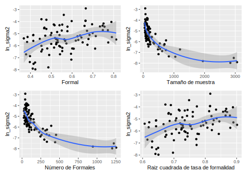
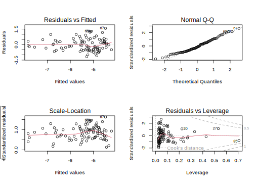
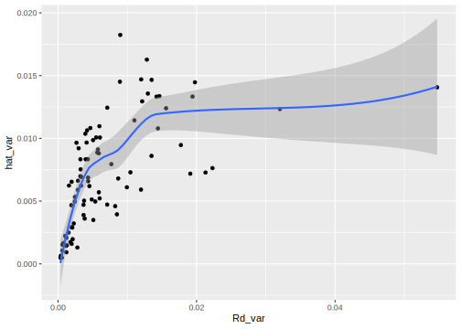
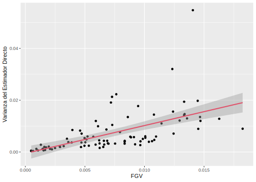
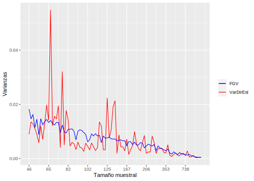
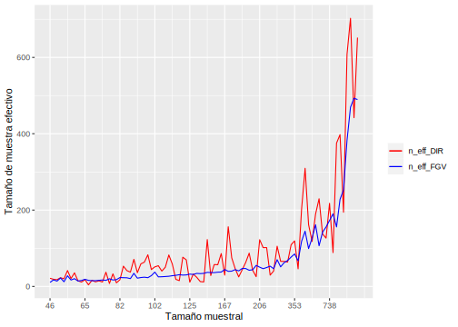

# Función generalizada de varianza 

Uno de los insumos más importantes en el modelo de áreas es la 
varianza del estimador directo, a nivel de dominio, la cual no puede calcularse de ningún modo. En correspondencia, este valor debe estimarse desde los datos recolectados en cada dominio. Sin embargo, 
en dominios en las que se cuenta con un tamaño de muestra muy pequeño, estas estimaciones no tendrán un buen comportamiento. Por ende, es muy útil utilizar un modelo de **suavizamiento** de las varianzas para 
eliminar el ruido y la volatilidad de estas estimaciones y extraer la verdadera señal del proceso

Hidiroglou (2019) afirma que $E_{mp}\left(\hat{\theta}^{dir}_d\right)=\boldsymbol{x}_{d}\boldsymbol{\beta}$ y $V_{mp}\left(\hat{\theta}^{dir}_d\right)=\sigma_{u}^2+\tilde{\psi}^2_{d}$, en donde el subíndice  $mp$ hace referencia a la inferencia doble que se debe tener en cuenta en este tipo de ajustes y define la medida de probabilidad conjunta entre el modelo y el diseño de muestreo.  

-   $m$ hace referencia a la medida de probabilidad inducida por el modelamiento y la inclusión de las covariables auxiliares ($\boldsymbol{x}_{d}$).

-   $p$ hacer referencia a la medida de probabilidad inducida por el diseño de muestreo complejo que 
induce las estimaciones directas. 

La solución que acá se plantea se conoce con el nombre de Función Generalizada de Varianza, la cual consiste en ajustar un modelo log-lineal a la varianza directa estimada. Partiendo del hecho de que
se tiene acceso a un estimador insesgado de $\psi^2$, denotado por $\hat{\psi}^2$ se tiene que:
$$
E_{mp}\left(\hat{\psi}_{d}^{2}\right)=E_{m}\left(E_{p}\left(\psi_{d}^{2}\right)\right)=E_{m}\left(\psi_{d}^{2}\right)=\tilde{\psi}_{d}^{2}
$$

La anterior igualdad puede interpretarse como que un estimador insesgado y simple de $\tilde{\psi}_{d}^{2}$ puede ser $\hat{\psi}_{d}^{2}$. Sin embargo, este estimador de muestreo es inestable cuando el tamaño de muestra es pequeño, que es justo el paradigma dominante en la estimación de áreas pequeñas. Rivest and Belmonte (2000) consideran modelos de suavizamiento para la estimación de las varianzas directas definidos de la siguiente manera:

$$
\log\left(\hat{\psi}_{d}^{2}\right)=\boldsymbol{z}_{d}^{t}\boldsymbol{\alpha}+\boldsymbol{\varepsilon}_{d}
$$

En donde $\boldsymbol{z}_{d}$ es un vector de covariables explicativas que son funciones de $\boldsymbol{x}_{d}$, $\boldsymbol{\alpha}$ es un vector de parámetros que deben ser estimados, $\boldsymbol{\varepsilon}_{d}$ son errores aleatorios con media cero y varianza constante, que se asumen idénticamente distribuidos condicionalmente sobre $\boldsymbol{z}_{d}$. Del anterior modelo, la
estimación suavizada de la varianza de muestreo está dada por:
$$
\tilde{\psi}_{d}^{2}=E_{mp}\left(\psi_{d}^{2}\right)=\exp\left(\boldsymbol{z}_{d}^{t}\boldsymbol{\alpha}\right)\times\Delta
$$

En donde, $E_{mp}\left(\varepsilon_{d}\right)=\Delta$. No hay necesidad de especificar una distribución paramétrica para los
errores de este modelo. Al utilizar el método de los momentos, se tiene el siguiente estimador insesgado para $\Delta$: 
$$
\hat{\Delta}=\frac{\sum_{d=1}^{D}\hat{\psi}_{d}^{2}}{\sum_{d=1}^{D}\exp\left(\boldsymbol{z}_{d}^{t}\boldsymbol{\alpha}\right)}
$$

De la misma forma, al utilizar los procedimientos estándar en una regresión lineal, la estimación del coeficiente de parámetros de regresión está dada por la siguiente expresión:

$$
\hat{\boldsymbol{\alpha}}=\left(\sum_{d=1}^{D}\boldsymbol{z}_{d}\boldsymbol{z}_{d}^{t}\right)^{-1}\sum_{d=1}^{D}\boldsymbol{z}_{d}\log\left(\hat{\psi}_{d}^{2}\right)
$$

Por último, el estimador suavizado de la varianza muestral está definido por:

$$
\hat{\tilde{\psi}}_{d}^{2}=\exp\left(\boldsymbol{z}_{d}^{t}\hat{\boldsymbol{\alpha}}\right)\hat{\Delta}
$$

## Lectura de librerías

En cada etapa del proceso, es común comenzar cargando las librerías necesarias. Para ajustar el modelo log-lineal, se utilizó el paquete `base` de R. Además, se generaron gráficos para el análisis exploratorio de los datos, utilizando las librerías `ggplot2` y `patchwork.` Para el procesamiento de la base, se implementó el paquete `dplyr` y se definió la función `select()` como medida de prevención de conflictos entre funciones de otros paquetes. Además, se estableció la variable `id_dominio` como parte del proceso de estandarización.


```r
library(ggplot2)
library(dplyr)
library(patchwork)
select <- dplyr::select
id_dominio <- "id_dominio"
```

## Lectura del la base de datos 

El código presentado es utilizado para procesar una base de datos de una encuesta en formato `.Rds.` Primero se carga la base de datos y se agrega un cero al inicio de la variable UPM con la función` str_pad()`. Posteriormente, se crea un objeto `n_upm` que contiene el número de Unidades Primarias de Muestreo (UPM) por dominio, esto se logra a través de la función `distinct()` para seleccionar las columnas que cumplen ciertas condiciones y la función `group_by()` para agrupar los datos por dominio. Finalmente, se utiliza `tally()` para contar el número de UPM por dominio y se presenta la tabla resultante con la función` tba()`.


```r
encuestaDOM <-  readRDS("../Data/encuestaDOM.Rds") %>% 
  mutate(
    upm = str_pad(string = upm,width = 9,pad = "0"))

n_upm <- encuestaDOM %>% distinct(id_dominio, upm) %>% 
  group_by(id_dominio) %>% tally(name = "n_upm",sort = TRUE)
tba(head(n_upm,10))
```

<table class="table table-striped lightable-classic" style="width: auto !important; margin-left: auto; margin-right: auto; font-family: Arial Narrow; width: auto !important; margin-left: auto; margin-right: auto;">
 <thead>
  <tr>
   <th style="text-align:left;"> id_dominio </th>
   <th style="text-align:right;"> n_upm </th>
  </tr>
 </thead>
<tbody>
  <tr>
   <td style="text-align:left;"> 0101 </td>
   <td style="text-align:right;"> 127 </td>
  </tr>
  <tr>
   <td style="text-align:left;"> 3201 </td>
   <td style="text-align:right;"> 109 </td>
  </tr>
  <tr>
   <td style="text-align:left;"> 2501 </td>
   <td style="text-align:right;"> 87 </td>
  </tr>
  <tr>
   <td style="text-align:left;"> 3203 </td>
   <td style="text-align:right;"> 59 </td>
  </tr>
  <tr>
   <td style="text-align:left;"> 3202 </td>
   <td style="text-align:right;"> 42 </td>
  </tr>
  <tr>
   <td style="text-align:left;"> 1101 </td>
   <td style="text-align:right;"> 38 </td>
  </tr>
  <tr>
   <td style="text-align:left;"> 3206 </td>
   <td style="text-align:right;"> 32 </td>
  </tr>
  <tr>
   <td style="text-align:left;"> 0901 </td>
   <td style="text-align:right;"> 20 </td>
  </tr>
  <tr>
   <td style="text-align:left;"> 1301 </td>
   <td style="text-align:right;"> 20 </td>
  </tr>
  <tr>
   <td style="text-align:left;"> 2101 </td>
   <td style="text-align:right;"> 20 </td>
  </tr>
</tbody>
</table>


## Lectura de las estimaciones directas del indicador 

El código está realizando una unión completa (full join) de dos bases de datos indicador_dom y n_upm, usando la variable id_dominio como clave. La unión completa asegura que se conserven todas las filas de ambas bases de datos, incluso aquellas que no tienen coincidencias en la otra base de datos. Después de la unión, la variable n_upm (que indica el número de UPMs por dominio) se añade a la base de datos indicador_dom.


```r
indicador_dom <- readRDS('../Data/indicador_dom.Rds')
indicador_dom <- full_join(indicador_dom, n_upm, by = id_dominio)
```

Se filtran los dominios que posean una varianza estimada mayor que cero, un deff mayor que 1 y 2 o más UPMs


```r
indicador_dom1 <- indicador_dom %>% 
  filter(Rd_var>0 & Rd_deff>=1 & n_upm >= 2) 
```

para los dominios que superan estas condiciones se realiza la transformación $\log(\hat{\sigma}^2_d)$, además se realiza la selección de las columnas identificador del municipio (`id_dominio`), la estimación directa del indicador (`Rd`), El número de personas en el dominio (`n`) y la varianza estimada del para la estimación directa `Rd_var`,siendo esta la que transforma mediante la función `log()`. 


```r
baseFGV <-  indicador_dom1 %>%  
  dplyr::select(id_dominio , Rd, n, Rd_var) %>%
  mutate(ln_sigma2 = log(Rd_var))
```

## Gráficas exploratorias

El código muestra la creación de cuatro gráficos usando la librería `ggplot2` y el uso de los datos `baseFGV`.  Estos gráficos tienen como objetivo explorar la relación entre el logaritmo de la varianza y diferentes transformaciones de la `n` y `Rd`.

El primer gráfico (`p1`) representa la relación entre la estimación directa y el logaritmo de la varianza. El segundo gráfico (`p2`) representa la relación entre el tamaño de muestra y el logaritmo de la varianza. El tercer gráfico (`p3`) representa la relación entre $n_d \times Rd$  y el logaritmo de la varianza. Finalmente, el cuarto gráfico (`p4`) representa la relación entre la raíz cuadrada de la estimación directa y el logaritmo de la varianza.


```r
p1 <- ggplot(baseFGV, aes(x = Rd, y = ln_sigma2)) +
  geom_point() +
  geom_smooth(method = "loess") +
  xlab("Formal")

p2 <- ggplot(baseFGV, aes(x = n, y = ln_sigma2)) + 
  geom_point() +
  geom_smooth(method = "loess") + 
  xlab("Tamaño de muestra")

p3 <- ggplot(baseFGV, 
             aes(x = Rd * n, y = ln_sigma2)) + 
  geom_point() +
  geom_smooth(method = "loess") + 
  xlab("Número de Formales")

p4 <- ggplot(baseFGV, 
             aes(x = sqrt(Rd), y = ln_sigma2)) + 
  geom_point() +
  geom_smooth(method = "loess") + 
  xlab("Raiz cuadrada de tasa de formalidad")


(p1 | p2) / (p3 | p4)
```



```r
rm('p1','p2','p3','p4')
```

## Ajustando el modelo log-lineal de la varianza 

El código ajusta un modelo de regresión lineal múltiple (utilizando la función `lm()`), donde `ln_sigma2` es la variable respuesta y las variables predictoras son `Rd`, `n`, y varias transformaciones de éstas. El objetivo de este modelo es estimar la función generalizada de varianza (FGV) para los dominios observados.


```r
library(gtsummary)
FGV1 <- lm(ln_sigma2 ~ 1 + Rd + 
             n + I(n ^ 2) + I(Rd * n) +
             I(sqrt(Rd)) + I(sqrt(n)) + 
             I(sqrt(Rd * n)) ,
           data = baseFGV)

tbl_regression(FGV1) %>% 
  add_glance_table(include = c(r.squared, adj.r.squared))
```

```{=html}
<div id="lkbcxihqec" style="padding-left:0px;padding-right:0px;padding-top:10px;padding-bottom:10px;overflow-x:auto;overflow-y:auto;width:auto;height:auto;">
<style>html {
  font-family: -apple-system, BlinkMacSystemFont, 'Segoe UI', Roboto, Oxygen, Ubuntu, Cantarell, 'Helvetica Neue', 'Fira Sans', 'Droid Sans', Arial, sans-serif;
}

#lkbcxihqec .gt_table {
  display: table;
  border-collapse: collapse;
  margin-left: auto;
  margin-right: auto;
  color: #333333;
  font-size: 16px;
  font-weight: normal;
  font-style: normal;
  background-color: #FFFFFF;
  width: auto;
  border-top-style: solid;
  border-top-width: 2px;
  border-top-color: #A8A8A8;
  border-right-style: none;
  border-right-width: 2px;
  border-right-color: #D3D3D3;
  border-bottom-style: solid;
  border-bottom-width: 2px;
  border-bottom-color: #A8A8A8;
  border-left-style: none;
  border-left-width: 2px;
  border-left-color: #D3D3D3;
}

#lkbcxihqec .gt_heading {
  background-color: #FFFFFF;
  text-align: center;
  border-bottom-color: #FFFFFF;
  border-left-style: none;
  border-left-width: 1px;
  border-left-color: #D3D3D3;
  border-right-style: none;
  border-right-width: 1px;
  border-right-color: #D3D3D3;
}

#lkbcxihqec .gt_caption {
  padding-top: 4px;
  padding-bottom: 4px;
}

#lkbcxihqec .gt_title {
  color: #333333;
  font-size: 125%;
  font-weight: initial;
  padding-top: 4px;
  padding-bottom: 4px;
  padding-left: 5px;
  padding-right: 5px;
  border-bottom-color: #FFFFFF;
  border-bottom-width: 0;
}

#lkbcxihqec .gt_subtitle {
  color: #333333;
  font-size: 85%;
  font-weight: initial;
  padding-top: 0;
  padding-bottom: 6px;
  padding-left: 5px;
  padding-right: 5px;
  border-top-color: #FFFFFF;
  border-top-width: 0;
}

#lkbcxihqec .gt_bottom_border {
  border-bottom-style: solid;
  border-bottom-width: 2px;
  border-bottom-color: #D3D3D3;
}

#lkbcxihqec .gt_col_headings {
  border-top-style: solid;
  border-top-width: 2px;
  border-top-color: #D3D3D3;
  border-bottom-style: solid;
  border-bottom-width: 2px;
  border-bottom-color: #D3D3D3;
  border-left-style: none;
  border-left-width: 1px;
  border-left-color: #D3D3D3;
  border-right-style: none;
  border-right-width: 1px;
  border-right-color: #D3D3D3;
}

#lkbcxihqec .gt_col_heading {
  color: #333333;
  background-color: #FFFFFF;
  font-size: 100%;
  font-weight: normal;
  text-transform: inherit;
  border-left-style: none;
  border-left-width: 1px;
  border-left-color: #D3D3D3;
  border-right-style: none;
  border-right-width: 1px;
  border-right-color: #D3D3D3;
  vertical-align: bottom;
  padding-top: 5px;
  padding-bottom: 6px;
  padding-left: 5px;
  padding-right: 5px;
  overflow-x: hidden;
}

#lkbcxihqec .gt_column_spanner_outer {
  color: #333333;
  background-color: #FFFFFF;
  font-size: 100%;
  font-weight: normal;
  text-transform: inherit;
  padding-top: 0;
  padding-bottom: 0;
  padding-left: 4px;
  padding-right: 4px;
}

#lkbcxihqec .gt_column_spanner_outer:first-child {
  padding-left: 0;
}

#lkbcxihqec .gt_column_spanner_outer:last-child {
  padding-right: 0;
}

#lkbcxihqec .gt_column_spanner {
  border-bottom-style: solid;
  border-bottom-width: 2px;
  border-bottom-color: #D3D3D3;
  vertical-align: bottom;
  padding-top: 5px;
  padding-bottom: 5px;
  overflow-x: hidden;
  display: inline-block;
  width: 100%;
}

#lkbcxihqec .gt_group_heading {
  padding-top: 8px;
  padding-bottom: 8px;
  padding-left: 5px;
  padding-right: 5px;
  color: #333333;
  background-color: #FFFFFF;
  font-size: 100%;
  font-weight: initial;
  text-transform: inherit;
  border-top-style: solid;
  border-top-width: 2px;
  border-top-color: #D3D3D3;
  border-bottom-style: solid;
  border-bottom-width: 2px;
  border-bottom-color: #D3D3D3;
  border-left-style: none;
  border-left-width: 1px;
  border-left-color: #D3D3D3;
  border-right-style: none;
  border-right-width: 1px;
  border-right-color: #D3D3D3;
  vertical-align: middle;
  text-align: left;
}

#lkbcxihqec .gt_empty_group_heading {
  padding: 0.5px;
  color: #333333;
  background-color: #FFFFFF;
  font-size: 100%;
  font-weight: initial;
  border-top-style: solid;
  border-top-width: 2px;
  border-top-color: #D3D3D3;
  border-bottom-style: solid;
  border-bottom-width: 2px;
  border-bottom-color: #D3D3D3;
  vertical-align: middle;
}

#lkbcxihqec .gt_from_md > :first-child {
  margin-top: 0;
}

#lkbcxihqec .gt_from_md > :last-child {
  margin-bottom: 0;
}

#lkbcxihqec .gt_row {
  padding-top: 8px;
  padding-bottom: 8px;
  padding-left: 5px;
  padding-right: 5px;
  margin: 10px;
  border-top-style: solid;
  border-top-width: 1px;
  border-top-color: #D3D3D3;
  border-left-style: none;
  border-left-width: 1px;
  border-left-color: #D3D3D3;
  border-right-style: none;
  border-right-width: 1px;
  border-right-color: #D3D3D3;
  vertical-align: middle;
  overflow-x: hidden;
}

#lkbcxihqec .gt_stub {
  color: #333333;
  background-color: #FFFFFF;
  font-size: 100%;
  font-weight: initial;
  text-transform: inherit;
  border-right-style: solid;
  border-right-width: 2px;
  border-right-color: #D3D3D3;
  padding-left: 5px;
  padding-right: 5px;
}

#lkbcxihqec .gt_stub_row_group {
  color: #333333;
  background-color: #FFFFFF;
  font-size: 100%;
  font-weight: initial;
  text-transform: inherit;
  border-right-style: solid;
  border-right-width: 2px;
  border-right-color: #D3D3D3;
  padding-left: 5px;
  padding-right: 5px;
  vertical-align: top;
}

#lkbcxihqec .gt_row_group_first td {
  border-top-width: 2px;
}

#lkbcxihqec .gt_summary_row {
  color: #333333;
  background-color: #FFFFFF;
  text-transform: inherit;
  padding-top: 8px;
  padding-bottom: 8px;
  padding-left: 5px;
  padding-right: 5px;
}

#lkbcxihqec .gt_first_summary_row {
  border-top-style: solid;
  border-top-color: #D3D3D3;
}

#lkbcxihqec .gt_first_summary_row.thick {
  border-top-width: 2px;
}

#lkbcxihqec .gt_last_summary_row {
  padding-top: 8px;
  padding-bottom: 8px;
  padding-left: 5px;
  padding-right: 5px;
  border-bottom-style: solid;
  border-bottom-width: 2px;
  border-bottom-color: #D3D3D3;
}

#lkbcxihqec .gt_grand_summary_row {
  color: #333333;
  background-color: #FFFFFF;
  text-transform: inherit;
  padding-top: 8px;
  padding-bottom: 8px;
  padding-left: 5px;
  padding-right: 5px;
}

#lkbcxihqec .gt_first_grand_summary_row {
  padding-top: 8px;
  padding-bottom: 8px;
  padding-left: 5px;
  padding-right: 5px;
  border-top-style: double;
  border-top-width: 6px;
  border-top-color: #D3D3D3;
}

#lkbcxihqec .gt_striped {
  background-color: rgba(128, 128, 128, 0.05);
}

#lkbcxihqec .gt_table_body {
  border-top-style: solid;
  border-top-width: 2px;
  border-top-color: #D3D3D3;
  border-bottom-style: solid;
  border-bottom-width: 2px;
  border-bottom-color: #D3D3D3;
}

#lkbcxihqec .gt_footnotes {
  color: #333333;
  background-color: #FFFFFF;
  border-bottom-style: none;
  border-bottom-width: 2px;
  border-bottom-color: #D3D3D3;
  border-left-style: none;
  border-left-width: 2px;
  border-left-color: #D3D3D3;
  border-right-style: none;
  border-right-width: 2px;
  border-right-color: #D3D3D3;
}

#lkbcxihqec .gt_footnote {
  margin: 0px;
  font-size: 90%;
  padding-left: 4px;
  padding-right: 4px;
  padding-left: 5px;
  padding-right: 5px;
}

#lkbcxihqec .gt_sourcenotes {
  color: #333333;
  background-color: #FFFFFF;
  border-bottom-style: none;
  border-bottom-width: 2px;
  border-bottom-color: #D3D3D3;
  border-left-style: none;
  border-left-width: 2px;
  border-left-color: #D3D3D3;
  border-right-style: none;
  border-right-width: 2px;
  border-right-color: #D3D3D3;
}

#lkbcxihqec .gt_sourcenote {
  font-size: 90%;
  padding-top: 4px;
  padding-bottom: 4px;
  padding-left: 5px;
  padding-right: 5px;
}

#lkbcxihqec .gt_left {
  text-align: left;
}

#lkbcxihqec .gt_center {
  text-align: center;
}

#lkbcxihqec .gt_right {
  text-align: right;
  font-variant-numeric: tabular-nums;
}

#lkbcxihqec .gt_font_normal {
  font-weight: normal;
}

#lkbcxihqec .gt_font_bold {
  font-weight: bold;
}

#lkbcxihqec .gt_font_italic {
  font-style: italic;
}

#lkbcxihqec .gt_super {
  font-size: 65%;
}

#lkbcxihqec .gt_footnote_marks {
  font-style: italic;
  font-weight: normal;
  font-size: 75%;
  vertical-align: 0.4em;
}

#lkbcxihqec .gt_asterisk {
  font-size: 100%;
  vertical-align: 0;
}

#lkbcxihqec .gt_indent_1 {
  text-indent: 5px;
}

#lkbcxihqec .gt_indent_2 {
  text-indent: 10px;
}

#lkbcxihqec .gt_indent_3 {
  text-indent: 15px;
}

#lkbcxihqec .gt_indent_4 {
  text-indent: 20px;
}

#lkbcxihqec .gt_indent_5 {
  text-indent: 25px;
}
</style>
<table class="gt_table">
  
  <thead class="gt_col_headings">
    <tr>
      <th class="gt_col_heading gt_columns_bottom_border gt_left" rowspan="1" colspan="1" scope="col" id="&lt;strong&gt;Characteristic&lt;/strong&gt;"><strong>Characteristic</strong></th>
      <th class="gt_col_heading gt_columns_bottom_border gt_center" rowspan="1" colspan="1" scope="col" id="&lt;strong&gt;Beta&lt;/strong&gt;"><strong>Beta</strong></th>
      <th class="gt_col_heading gt_columns_bottom_border gt_center" rowspan="1" colspan="1" scope="col" id="&lt;strong&gt;95% CI&lt;/strong&gt;&lt;sup class=&quot;gt_footnote_marks&quot;&gt;1&lt;/sup&gt;"><strong>95% CI</strong><sup class="gt_footnote_marks">1</sup></th>
      <th class="gt_col_heading gt_columns_bottom_border gt_center" rowspan="1" colspan="1" scope="col" id="&lt;strong&gt;p-value&lt;/strong&gt;"><strong>p-value</strong></th>
    </tr>
  </thead>
  <tbody class="gt_table_body">
    <tr><td headers="label" class="gt_row gt_left">Rd</td>
<td headers="estimate" class="gt_row gt_center">-22</td>
<td headers="ci" class="gt_row gt_center">-50, 5.8</td>
<td headers="p.value" class="gt_row gt_center">0.12</td></tr>
    <tr><td headers="label" class="gt_row gt_left">n</td>
<td headers="estimate" class="gt_row gt_center">-0.01</td>
<td headers="ci" class="gt_row gt_center">-0.03, 0.01</td>
<td headers="p.value" class="gt_row gt_center">0.3</td></tr>
    <tr><td headers="label" class="gt_row gt_left">I(n^2)</td>
<td headers="estimate" class="gt_row gt_center">0.00</td>
<td headers="ci" class="gt_row gt_center">0.00, 0.00</td>
<td headers="p.value" class="gt_row gt_center">0.5</td></tr>
    <tr><td headers="label" class="gt_row gt_left">I(Rd * n)</td>
<td headers="estimate" class="gt_row gt_center">0.02</td>
<td headers="ci" class="gt_row gt_center">-0.01, 0.05</td>
<td headers="p.value" class="gt_row gt_center">0.2</td></tr>
    <tr><td headers="label" class="gt_row gt_left">I(sqrt(Rd))</td>
<td headers="estimate" class="gt_row gt_center">45</td>
<td headers="ci" class="gt_row gt_center">-4.7, 94</td>
<td headers="p.value" class="gt_row gt_center">0.076</td></tr>
    <tr><td headers="label" class="gt_row gt_left">I(sqrt(n))</td>
<td headers="estimate" class="gt_row gt_center">0.87</td>
<td headers="ci" class="gt_row gt_center">-0.48, 2.2</td>
<td headers="p.value" class="gt_row gt_center">0.2</td></tr>
    <tr><td headers="label" class="gt_row gt_left">I(sqrt(Rd * n))</td>
<td headers="estimate" class="gt_row gt_center">-1.4</td>
<td headers="ci" class="gt_row gt_center">-3.1, 0.34</td>
<td headers="p.value" class="gt_row gt_center">0.11</td></tr>
    <tr><td headers="label" class="gt_row gt_left" style="border-top-width: 2px; border-top-style: solid; border-top-color: #D3D3D3;">R²</td>
<td headers="estimate" class="gt_row gt_center" style="border-top-width: 2px; border-top-style: solid; border-top-color: #D3D3D3;">0.683</td>
<td headers="ci" class="gt_row gt_center" style="border-top-width: 2px; border-top-style: solid; border-top-color: #D3D3D3;"></td>
<td headers="p.value" class="gt_row gt_center" style="border-top-width: 2px; border-top-style: solid; border-top-color: #D3D3D3;"></td></tr>
    <tr><td headers="label" class="gt_row gt_left">Adjusted R²</td>
<td headers="estimate" class="gt_row gt_center">0.656</td>
<td headers="ci" class="gt_row gt_center"></td>
<td headers="p.value" class="gt_row gt_center"></td></tr>
  </tbody>
  
  <tfoot class="gt_footnotes">
    <tr>
      <td class="gt_footnote" colspan="4"><sup class="gt_footnote_marks">1</sup> CI = Confidence Interval</td>
    </tr>
  </tfoot>
</table>
</div>
```

Después de tener la estimación del modelo se debe obtener el  valor de la constante $\Delta$ para lo cual se usa el siguiente código.  


```r
delta.hat = sum(baseFGV$Rd_var) / sum(exp(fitted.values(FGV1)))
```
De donde se obtiene que $\Delta = 1.2364741$. Final es posible obtener la varianza suavizada  ejecutando el siguiente comando. 


```r
baseFGV <-
  baseFGV %>% mutate(hat_var = delta.hat * exp(fitted.values(FGV1)))
```

## Validaciones sobre el modelo 


```r
par(mfrow = c(2, 2))
plot(FGV1)
```


varianza suavizada Vs varianza estimada 


```r
ggplot(baseFGV, 
       aes(x = Rd_var, y = hat_var)) + 
  geom_point() +
  geom_smooth(method = "loess")
```



Este código está realizando una Consolidación de los dominios observados y no observados para lo cual hace una unión izquierda (`left_join()`) entre: `indicador_dom` y `baseFGV` de la cual selecciona las columnas de `id_dominio` y `hat_var`. El argumento `by = id_dominio` especifica que la unión debe realizarse mediante la columna `id_dominio`.

Luego, se utiliza la función `mutate()` para crear dos nuevas variables. La primera variable `Rd_var` se asigna el valor de `Rd_var` de `baseFGV` si `hat_var` no es un valor nulo (`NA`), de lo contrario se le asigna un valor `NA_real_` (NA pero de tipo numérico). De manera similar, se crea la variable `Rd_deff` con el valor de `Rd_deff` de `baseFGV` si `hat_var` no es nulo, de lo contrario se le asigna un valor `NA_real_`. 


```r
base_sae <- left_join(indicador_dom,
                      baseFGV %>% select(id_dominio, hat_var), 
                      by = id_dominio) %>%
  mutate(
    Rd_var = ifelse(is.na(hat_var), NA_real_, Rd_var),
    Rd_deff = ifelse(is.na(hat_var), NA_real_, Rd_deff)
  )
```

Ahora, se debe estimar **deff_FGV** y **n_eff_FGV** a parir de la varianza suvizada (`hat_var`). 


```r
base_FH <- base_sae %>%
  mutate(
    Rd_deff = ifelse(is.nan(Rd_deff), 1, Rd_deff),
    deff_FGV = ifelse(Rd_var == 0 ,
      1,
      hat_var / (Rd_var / Rd_deff) #Fórmula del nuevo DEFF
    ),
   # Criterio MDS para regularizar el DeffFGV
    deff_FGV = ifelse(deff_FGV <= 1, NA_real_, deff_FGV), #Deff estimado
    n_eff_FGV = n / deff_FGV, #Número efectivo de personas encuestadas
   # Si no se estimó varianza para ese municipio, también excluir
   # la estimación directa de este municipio, esto es relevante para el modelo FH  
    hat_var = ifelse(deff_FGV <= 1, NA_real_, hat_var), 
    Rd = ifelse(is.na(hat_var), NA_real_, Rd) 
  )
tba(head(base_FH %>% select(id_dominio,n,n_upm,Rd, Rd_var,hat_var:n_eff_FGV), 10))
```

<table class="table table-striped lightable-classic" style="width: auto !important; margin-left: auto; margin-right: auto; font-family: Arial Narrow; width: auto !important; margin-left: auto; margin-right: auto;">
 <thead>
  <tr>
   <th style="text-align:left;"> id_dominio </th>
   <th style="text-align:right;"> n </th>
   <th style="text-align:right;"> n_upm </th>
   <th style="text-align:right;"> Rd </th>
   <th style="text-align:right;"> Rd_var </th>
   <th style="text-align:right;"> hat_var </th>
   <th style="text-align:right;"> deff_FGV </th>
   <th style="text-align:right;"> n_eff_FGV </th>
  </tr>
 </thead>
<tbody>
  <tr>
   <td style="text-align:left;"> 0101 </td>
   <td style="text-align:right;"> 2951 </td>
   <td style="text-align:right;"> 127 </td>
   <td style="text-align:right;"> 0.4147 </td>
   <td style="text-align:right;"> 0.0005 </td>
   <td style="text-align:right;"> 0.0005 </td>
   <td style="text-align:right;"> 5.9860 </td>
   <td style="text-align:right;"> 492.9810 </td>
  </tr>
  <tr>
   <td style="text-align:left;"> 0201 </td>
   <td style="text-align:right;"> 221 </td>
   <td style="text-align:right;"> 7 </td>
   <td style="text-align:right;"> 0.4526 </td>
   <td style="text-align:right;"> 0.0024 </td>
   <td style="text-align:right;"> 0.0053 </td>
   <td style="text-align:right;"> 4.7576 </td>
   <td style="text-align:right;"> 46.4517 </td>
  </tr>
  <tr>
   <td style="text-align:left;"> 0202 </td>
   <td style="text-align:right;"> 86 </td>
   <td style="text-align:right;"> 2 </td>
   <td style="text-align:right;"> NA </td>
   <td style="text-align:right;"> NA </td>
   <td style="text-align:right;"> NA </td>
   <td style="text-align:right;"> NA </td>
   <td style="text-align:right;"> NA </td>
  </tr>
  <tr>
   <td style="text-align:left;"> 0203 </td>
   <td style="text-align:right;"> 86 </td>
   <td style="text-align:right;"> 2 </td>
   <td style="text-align:right;"> 0.7138 </td>
   <td style="text-align:right;"> 0.0055 </td>
   <td style="text-align:right;"> 0.0101 </td>
   <td style="text-align:right;"> 4.2227 </td>
   <td style="text-align:right;"> 20.3661 </td>
  </tr>
  <tr>
   <td style="text-align:left;"> 0204 </td>
   <td style="text-align:right;"> 51 </td>
   <td style="text-align:right;"> 1 </td>
   <td style="text-align:right;"> NA </td>
   <td style="text-align:right;"> NA </td>
   <td style="text-align:right;"> NA </td>
   <td style="text-align:right;"> NA </td>
   <td style="text-align:right;"> NA </td>
  </tr>
  <tr>
   <td style="text-align:left;"> 0205 </td>
   <td style="text-align:right;"> 34 </td>
   <td style="text-align:right;"> 1 </td>
   <td style="text-align:right;"> NA </td>
   <td style="text-align:right;"> NA </td>
   <td style="text-align:right;"> NA </td>
   <td style="text-align:right;"> NA </td>
   <td style="text-align:right;"> NA </td>
  </tr>
  <tr>
   <td style="text-align:left;"> 0206 </td>
   <td style="text-align:right;"> 65 </td>
   <td style="text-align:right;"> 2 </td>
   <td style="text-align:right;"> 0.5527 </td>
   <td style="text-align:right;"> 0.0142 </td>
   <td style="text-align:right;"> 0.0133 </td>
   <td style="text-align:right;"> 3.4692 </td>
   <td style="text-align:right;"> 18.7366 </td>
  </tr>
  <tr>
   <td style="text-align:left;"> 0208 </td>
   <td style="text-align:right;"> 74 </td>
   <td style="text-align:right;"> 2 </td>
   <td style="text-align:right;"> 0.8122 </td>
   <td style="text-align:right;"> 0.0041 </td>
   <td style="text-align:right;"> 0.0097 </td>
   <td style="text-align:right;"> 4.6595 </td>
   <td style="text-align:right;"> 15.8814 </td>
  </tr>
  <tr>
   <td style="text-align:left;"> 0210 </td>
   <td style="text-align:right;"> 16 </td>
   <td style="text-align:right;"> 1 </td>
   <td style="text-align:right;"> NA </td>
   <td style="text-align:right;"> NA </td>
   <td style="text-align:right;"> NA </td>
   <td style="text-align:right;"> NA </td>
   <td style="text-align:right;"> NA </td>
  </tr>
  <tr>
   <td style="text-align:left;"> 0301 </td>
   <td style="text-align:right;"> 264 </td>
   <td style="text-align:right;"> 6 </td>
   <td style="text-align:right;"> 0.5668 </td>
   <td style="text-align:right;"> 0.0037 </td>
   <td style="text-align:right;"> 0.0039 </td>
   <td style="text-align:right;"> 4.2461 </td>
   <td style="text-align:right;"> 62.1742 </td>
  </tr>
</tbody>
</table>

El código anterior realiza algunas transformaciones y ajustes sobre la base de datos `base_sae` para obtener la base de datos `base_FH`. Primero, se verifica que el valor `Rd_deff` no sea `NaN`, en cuyo caso se establece en 1. A continuación, se calcula el nuevo valor del `deff_FGV` para cada municipio mediante la fórmula que incluye el valor de `hat_var` (la varianza estimada a través del modelo FGV) y los valores de `Rd_var` y `Rd_deff` (la varianza de diseño y el DEFF estimado). Si `Rd_var` es 0, entonces se establece `deff_FGV` en 1.

Luego, se utiliza el criterio MDS (Minimum Detectable Size) para regularizar el valor de `deff_FGV`, estableciendo en `NA` aquellos valores que son menores o iguales a 1. A partir de `deff_FGV`, se calcula el número efectivo de personas encuestadas `n_eff_FGV`.

Finalmente, se excluyen aquellos municipios para los cuales no se pudo estimar la varianza a través del modelo FGV, estableciendo en NA los valores de `hat_var` y `Rd`. El resultado es una base de datos que contiene información relevante para la construcción del modelo FH.

## Otras validaciones sobre el resultado del modelo. 

Continuando con el proceso de validación se construye el siguiente gráfico de dispersión con la variable de la varianza del estimador directo en el eje _y_ y la varianza FGV  en el eje _x_, para los municipios que tienen valores válidos para ambas variables. La línea de regresión lineal se ajusta a los puntos usando el método de mínimos cuadrados.

La visualización del gráfico permite evaluar si la FGV está capturando adecuadamente la variabilidad de la variable de interés (en este caso, la variable de varianza del estimador directo). Si la FGV captura la variabilidad, se espera que los puntos estén relativamente cerca de la línea de regresión, lo que indicaría que la FGV explica una gran parte de la variabilidad de la varianza del estimador directo. Por otro lado, si la FGV no captura la variabilidad, los puntos estarán más dispersos y alejados de la línea de regresión. 


```r
nDom <- sum(!is.na(base_FH$hat_var))
temp_FH <- base_FH %>% filter(!is.na(hat_var))

ggplot(temp_FH %>% arrange(n), aes(x = hat_var, y = Rd_var)) + 
  geom_point() + 
  geom_smooth(method = "lm", col = 2) + 
  labs(x = "FGV", y = "VaRdirEst") +
  ylab("Varianza del Estimador Directo")
```



Ahora, se realiza la comparación de la variabilidad de la varianza del estimador directo frente a la varianza suavizada a medida que el tamaño de muestra aumenta. El eje _x_ representa el tamaño de la muestra y el eje _y_ representa las varianzas. La línea azul representa la varianza FGV, mientras que la línea roja representa la varianza del estimador directo. En el gráfica es posible notar que la varianza FGV tiene una menos volatilidad que la varianza directa. 


```r
ggplot(temp_FH %>% 
         arrange(n), aes(x = 1:nDom)) +
  geom_line(aes(y = Rd_var, color = "VarDirEst")) +
  geom_line(aes(y = hat_var, color = "FGV")) +
  labs(y = "Varianzas", x = "Tamaño muestral", color = " ") +
  scale_x_continuous(breaks = seq(1, nDom, by = 10),
                     labels = temp_FH$n[order(temp_FH$n)][seq(1, nDom, by = 10)]) +
  scale_color_manual(values = c("FGV" = "Blue", "VarDirEst" = "Red"))
```



Siguiendo en la misma linea se realiza la comparación del *n efectivo directo (n_eff_DIR)* y el *n efectivo FGV (n_eff_DIR)*. El código que se muestra acontinuación produce un gráfico que compara el tamaño de muestra efectivo obtenido a través de la estimación del DEFF con el tamaño de muestra directo. En el eje _x_ se muestra el tamaño de muestra directo (`n`) y en el eje _y_ se muestra el tamaño de muestra efectivo, calculado a través de la fórmula n/DEFF para la estimación directa (rojo) y para la FGV (azul).

Se puede observar que, en general, el tamaño de muestra efectivo estimado a través de la FGV es menos variable que el estimado a través de la estimación directa, lo que indica que la FGV reduce la varianza de la estimación. Además, se puede observar que para algunos dominios el tamaño de muestra efectivo estimado a través de la FGV es menor que el tamaño de muestra directo, lo que puede deberse a que la estimación de la varianza a través de la FGV. En general, este gráfico es útil para comparar la eficiencia de la estimación a través de la FGV y la estimación directa para cada dominio.  


```r
ggplot(temp_FH %>%
         arrange(n), aes(x = 1:nDom)) +
  geom_line(aes(y =  n / Rd_deff, color = "n_eff_DIR")) +
  geom_line(aes(y = n_eff_FGV, color = "n_eff_FGV")) +
  labs(y = "Tamaño de muestra efectivo",
       x = "Tamaño muestral", color = " ") +
  scale_x_continuous(breaks = seq(1, nDom, by = 10),
                     labels = temp_FH$n[order(temp_FH$n)][seq(1, nDom, by = 10)]) +
  scale_color_manual(values = c("n_eff_FGV" = "Blue", "n_eff_DIR" = "red"))
```




Guardando el archivo 


```r
saveRDS(object = base_FH, "../Data/base_FH.Rds")
```

