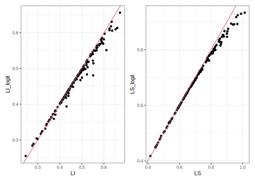

# Benchmark regional para las estimaciones del modelo de área

## Lectura de librerías


```r
library(survey)
library(srvyr)
library(TeachingSampling)
library(stringr)
library(magrittr)
library(sae)
library(ggplot2)
library(emdi)
library(patchwork)
library(DBI)
library(odbc)
library(flexmix)
library(modeltools)
library(sp)
library(sf)
library(rgdal)
library(tmap)
library(dplyr)
id_dominio <- "id_dominio"
```

## Lectura de bases de datos 

El código está leyendo varios archivos necesarios para el análisis.

  - `poligonos_dominios`: Es un archivo shapefile que contiene la información geográfica (polígonos) de los dominios de la encuesta. Se carga usando la función `read_sf()` del paquete `sf`.
  -   `base_completa`: Es un archivo RDS que contiene la información de la encuesta. Incluye información de los dominios, los estratos, los conglomerados y los pesos.
  -   `estimacionesPre`: Es un archivo RDS que contiene las estimaciones directas de los dominios.
  -   `base_FH`: Es una base que se crea al juntar la `base_completa` con las `estimacionesPre` usando la función `left_join()` del paquete `dplyr`.
  -   `encuesta`: Es un archivo RDS que contiene la información de la encuesta. 
  -   `fh_arcsin`: Es un archivo RDS que contiene las estimaciones del modelo ajustado de Fay-Herriot.
  -   `personas_dominio`: Es un archivo RDS que contiene número de personas en cada dominio.
  -   `personas_dominio_agregado`: Es un archivo RDS que contiene el número total de personas agregada por región.


```r
## Shapefile
poligonos_dominios <- read_sf( "../shapefiles2010/DOM.shp") 

## Base de estimaciones 
base_completa <- readRDS('../Data/base_completa.Rds')
estimacionesPre <- readRDS('../Data/estimaciones.Rds')
base_FH <- left_join(base_completa, estimacionesPre,   by = id_dominio)

## Encuesta
encuesta <- readRDS("../Data/encuestaDOM.Rds")

## Estimaciones del modelo ajustado
fh_arcsin <- readRDS("../Data/fh_arcsin.Rds")

## Agregados por dominios y región 
personas_dominio <- readRDS('../Data/agregado_persona_dominio.rds') 
personas_dominio_agregado <- readRDS('../Data/agregado_persona_region.rds') 
```

## Estimación directa por región 

El código carga y prepara los datos de la encuesta y luego calcula las estimaciones directas en cada región del país.

Primero, para el conjunto de datos de la encuesta se utiliza la función `mutate()` de `dplyr` para agregar tres columnas: `upm`, `estrato` y `factor_anual`. La columna `upm` es la identificación única de la unidad primaria de muestreo, `estrato` es la identificación del estrato en el que se encuentra la unidad primaria de muestreo y `factor_anual` es el factor de expansión anual, calculado dividiendo el factor de expansión trimestral entre 4.

A continuación, se utiliza la función `as_survey_design()` de la librería `survey` para crear un objeto de diseño de la encuesta a partir de los datos. La función utiliza las columnas `estrato`, `upm` y `factor_anual` para especificar las estrategias de muestreo, el peso de muestreo y la estructura de conglomerados.

Por último, se utiliza la función `group_by()` de `dplyr` para agrupar los datos por `id_region`, luego se utiliza la función `summarise()` de `dplyr` junto con `survey_ratio()` de `survey` para calcular la estimación directa. El resultado se asigna a un objeto llamado `directoDepto`, que contiene las columnas `id_region` y `theta_region`, que corresponde a la estimación directa en cada región.


```r
encuesta <-
  encuesta %>% 
  mutate(
    upm = str_pad(string = upm,width = 9,pad = "0"),
    estrato = str_pad(string = estrato,width = 5,pad = "0"),
    factor_anual = factor_expansion / 4
  ) %>% data.frame()

disenoDOM <- encuesta %>%
  as_survey_design(
    strata = estrato,
    ids = upm,
    weights = factor_anual,
    nest=T
  )

directoDepto <- disenoDOM %>%
  group_by(id_region) %>% 
  filter(ocupado == 1 & pet == 1) %>%
  summarise(Rd = survey_ratio(
    numerator = orden_sector == 2 ,
    denominator = 1,
    vartype = c("se", "ci", "var", "cv"),
    deff = T
  )) %>% 
  transmute(id_region, theta_region = Rd)
```

## Consolidación de la base de datos 

Este código realiza los siguientes pasos:

  -   Realiza un `left_join()` entre la tabla `directoDepto` y la tabla `personas_dominio` por la columna `id_region`. 
  -   Realiza un `left_join()` entre la tabla resultante del paso anterior y la tabla `personas_dominio_agregado` por la columna `id_region`. El resultado de esta unión es una tabla que agrega la información por dominio a nivel de región.
  
  -   Realiza un `left_join()` entre la tabla resultante del paso anterior y la tabla `estimacionesPre` por la columna `id_dominio`. El resultado de esta unión es una tabla que agrega la información de ambas tablas por dominio.
  -   Transmuta la columna `FayHerriot` de la tabla resultante del paso anterior y cambia su nombre a `FayHarriot`.
El resultado final es una tabla llamada `R_mpio` que contiene información agregada por región y dominio, así como las estimaciones por dominio utilizando el método de Fay Herriot.


```r
R_mpio <- directoDepto %>% 
  left_join(personas_dominio, by = 'id_region') %>%
  left_join(personas_dominio_agregado, by = "id_region") %>%
  left_join(estimacionesPre %>% 
              transmute(id_dominio, FayHerriot = FH),
            by = id_dominio) %>% 
  data.frame()
```


## Pesos Benchmark
Para obtener el factor multiplicador de de Benchmarking se ejecuta el código siguiente. 
El código está creando un objeto llamado `R_mpio2`, el cual se está construyendo a partir del objeto `R_mpio`. Primero, se agrupa por `id_region` usando `group_by()` y se calculan dos medidas de razón de la encuesta utilizando `summarise()`. Los cálculos de las medidas de razón no están claros ya que dependen de variables no presentes en el código. Luego, se realiza un `left_join()` con el objeto `directoDepto` para añadir la variable `theta_region`.

Posteriormente, se construye un objeto llamado pesos a partir del objeto `R_mpio` utilizando `ungroup()` para eliminar la agrupación anteriormente realizada. Luego, se añade la columna `W_i` que representa los pesos muestrales utilizados para el análisis.

La función `tba()` no está disponible en R base o en los paquetes `dplyr`, por lo que no es posible determinar lo que hace. Probablemente es una función personalizada por el autor del código.


```r
R_mpio2 <- R_mpio %>% 
  group_by(id_region) %>% 
  summarise(
    R_region_RB = unique(theta_region) / sum((pp_dominio  / pp_region ) * FayHerriot),
    R_region_DB = unique(theta_region) - sum((pp_dominio  / pp_region ) * FayHerriot)
  ) %>%
  left_join(directoDepto, by = "id_region")

pesos <- R_mpio %>% ungroup() %>% 
  mutate(W_i = pp_dominio / pp_region) %>% 
  dplyr::select(id_dominio, W_i)

head(pesos, 15) %>% tba()
```

<table class="table table-striped lightable-classic" style="width: auto !important; margin-left: auto; margin-right: auto; font-family: Arial Narrow; width: auto !important; margin-left: auto; margin-right: auto;">
 <thead>
  <tr>
   <th style="text-align:left;"> id_dominio </th>
   <th style="text-align:right;"> W_i </th>
  </tr>
 </thead>
<tbody>
  <tr>
   <td style="text-align:left;"> 0101 </td>
   <td style="text-align:right;"> 0.2890 </td>
  </tr>
  <tr>
   <td style="text-align:left;"> 3201 </td>
   <td style="text-align:right;"> 0.2841 </td>
  </tr>
  <tr>
   <td style="text-align:left;"> 3202 </td>
   <td style="text-align:right;"> 0.1088 </td>
  </tr>
  <tr>
   <td style="text-align:left;"> 3203 </td>
   <td style="text-align:right;"> 0.1585 </td>
  </tr>
  <tr>
   <td style="text-align:left;"> 3204 </td>
   <td style="text-align:right;"> 0.0425 </td>
  </tr>
  <tr>
   <td style="text-align:left;"> 3205 </td>
   <td style="text-align:right;"> 0.0132 </td>
  </tr>
  <tr>
   <td style="text-align:left;"> 3206 </td>
   <td style="text-align:right;"> 0.0817 </td>
  </tr>
  <tr>
   <td style="text-align:left;"> 3207 </td>
   <td style="text-align:right;"> 0.0222 </td>
  </tr>
  <tr>
   <td style="text-align:left;"> 0901 </td>
   <td style="text-align:right;"> 0.0554 </td>
  </tr>
  <tr>
   <td style="text-align:left;"> 0902 </td>
   <td style="text-align:right;"> 0.0021 </td>
  </tr>
  <tr>
   <td style="text-align:left;"> 0903 </td>
   <td style="text-align:right;"> 0.0115 </td>
  </tr>
  <tr>
   <td style="text-align:left;"> 0904 </td>
   <td style="text-align:right;"> 0.0024 </td>
  </tr>
  <tr>
   <td style="text-align:left;"> 1801 </td>
   <td style="text-align:right;"> 0.0489 </td>
  </tr>
  <tr>
   <td style="text-align:left;"> 1802 </td>
   <td style="text-align:right;"> 0.0058 </td>
  </tr>
  <tr>
   <td style="text-align:left;"> 1803 </td>
   <td style="text-align:right;"> 0.0020 </td>
  </tr>
</tbody>
</table>

## Estimación FH Benchmark 

El siguiente código realiza una serie de operaciones sobre dos `data.frames`: `estimacionesPre` y `R_mpio` para obtener las estimaciones ajustadas mediante el benchmarking.

En primer lugar, se realiza un `left_join` entre `estimacionesPre` y `R_mpio` utilizando la columna `id_dominio`. 

Luego, se realiza un nuevo `left_join` entre este `data.frame` resultante y `R_mpio2`, utilizando la columna `id_region`. Este join agrega las columnas `R_region_RB` y `R_region_DB` de `R_mpio2` al `data.frame()`.

A continuación, se calcula una nueva columna llamada `FH_RBench` que resulta de multiplicar la columna FH por la columna `R_region_RB`.

Por último, se realiza un join entre este `data.frame` resultante y pesos, utilizando la columna `id_dominio`. Este join agrega la columna `W_i` de `pesos` al `data.frame`. El resultado final se guarda en la variable `estimacionesBench`.


```r
estimacionesBench <- estimacionesPre %>% 
  left_join(R_mpio %>% 
              dplyr::select(id_region, id_dominio), 
            by = id_dominio) %>%
  left_join(R_mpio2, by = c("id_region")) %>% ungroup() %>% 
  mutate(FH_RBench = R_region_RB * FH) %>%
  left_join(pesos, by = id_dominio)
```

### Validación: Estimación FH con Benchmark 
Al realizar el proceso de validación notamos que las estimaciones con directas de las regiones y las estimaciones de FH con Benchmarking  son iguales. 

```r
estimacionesBench %>% group_by(id_region) %>%
  summarise(theta_reg_RB = sum(W_i * FH_RBench)) %>%
  left_join(directoDepto, by = "id_region") %>% 
  tba()
```

<table class="table table-striped lightable-classic" style="width: auto !important; margin-left: auto; margin-right: auto; font-family: Arial Narrow; width: auto !important; margin-left: auto; margin-right: auto;">
 <thead>
  <tr>
   <th style="text-align:left;"> id_region </th>
   <th style="text-align:right;"> theta_reg_RB </th>
   <th style="text-align:right;"> theta_region </th>
  </tr>
 </thead>
<tbody>
  <tr>
   <td style="text-align:left;"> 01 </td>
   <td style="text-align:right;"> 0.4331 </td>
   <td style="text-align:right;"> 0.4331 </td>
  </tr>
  <tr>
   <td style="text-align:left;"> 02 </td>
   <td style="text-align:right;"> 0.5231 </td>
   <td style="text-align:right;"> 0.5231 </td>
  </tr>
  <tr>
   <td style="text-align:left;"> 03 </td>
   <td style="text-align:right;"> 0.5566 </td>
   <td style="text-align:right;"> 0.5566 </td>
  </tr>
  <tr>
   <td style="text-align:left;"> 04 </td>
   <td style="text-align:right;"> 0.4685 </td>
   <td style="text-align:right;"> 0.4685 </td>
  </tr>
</tbody>
</table>

### Comparación gráfica entre estimación FH y FH con Benchmark por dominio 

El código presentado realiza una comparación de las estimaciones Fay-Herriot originales con las estimaciones Fay-Herriot con benchmark.


```r
temp_Bench <- estimacionesBench %>%
  transmute(
    id_dominio,
    Directo = Direct * 100,
    FayHerriot = FH * 100,
    FH_RBench = FH_RBench * 100,
    Gamma)

theme_set(theme_bw())
ggplot(temp_Bench, aes(FH_RBench, FayHerriot)) + 
  geom_point() + geom_abline(intercept = 0, slope = 1) + 
  labs(y = "Estimación Fay-Herriot",
       x = "Estimación Fay-Herriot con Benchmark")
```


## Tabla final de estimaciones 

### Función para el calculo de intervalos de confianza 

La función `ICL()` sirve para calcular intervalos de confianza para la proporción de una población, dada una muestra y un nivel de confianza. Los argumentos de la función son:

  -   `p`: la proporción muestral
  -   `mse`: el error cuadrático medio
  -   `alpha`: el nivel de confianza deseado (por defecto es 0.05)
  -   `student`: un indicador booleano que indica si se debe usar una distribución t de Student en lugar de la distribución normal para el cálculo del intervalo de confianza (por defecto es FALSE)
  -   `nu`: el número de grados de libertad si se usa una distribución t de Student (por defecto es NULL y se calcula automáticamente)


```r
ICL <- function(p, mse, alpha = 0.05, student = FALSE, nu = NULL) {
  if (student == TRUE) {
    q <- qt(1 - alpha/2, nu)
  } else {
    q <- qnorm(1 - alpha/2)
  }
  CL <- log(p/(1 - p)) - (q * sqrt(mse))/(p * (1 - p))
  CU <- log(p/(1 - p)) + (q * sqrt(mse))/(p * (1 - p))
  IC_1 <- exp(CL)/(1 + exp(CL))
  IC_2 <- exp(CU)/(1 + exp(CU))
  
  return(data.frame(L.I = IC_1, L.S = IC_2))
}
```

La función `TablaFinal` toma como entrada la tabla `estimacionesBench` y realiza una serie de transformaciones y cálculos para generar una tabla final con las estimaciones y los intervalos de confianza correspondientes.

Primero, agrega dos columnas nuevas: `sintetico` y `sintetico_back`. La columna `sintetico` se obtiene a partir de una matriz generada a partir de la columna `base_FH` de la tabla `estimacionesBench`, que contiene los valores de las variables auxiliares utilizadas en el modelo de Fay-Herriot. Esta matriz se multiplica por los coeficientes del modelo ajustado, que se asume que se ha generado previamente. La columna `sintetico_back` es el resultado de aplicar una transformación inversa al valor de `sintetico`.

Luego, se seleccionan y renombran las columnas que se incluirán en la tabla final. Estas columnas incluyen la estimación directa (`Directo`), el error estándar de la estimación directa (`ee_directo`), el coeficiente de variación de la estimación directa (`CV_directo`), la estimación de Fay-Herriot (`FayHerriot`), la raíz del error cuadrático medio de la estimación de Fay-Herriot (`rmse_FH`), el coeficiente de variación de la estimación de Fay-Herriot (`rrmse_FH`), la estimación de  gamma (`Gamma`), las estimaciones sintéticas (`sintetico` y `sintetico_back`), la estimación de Fay-Herriot con el ajuste de benchmark (`FH_RBench`), y los límites inferior y superior de los intervalos de confianza calculados utilizando el método de la distribución normal (`LI_normal` y `LS_normal`) y el método logit (`LI_logit` y `LS_logit`). Finalmente, se calculan los límites inferior y superior de los intervalos de confianza finales (`LI_final` y `LS_final`), teniendo en cuenta los límites de 0 y 1.


```r
TablaFinal <- estimacionesBench %>%
  mutate(
    sintetico = as.matrix(base_FH %>% data.frame() %>% 
                            dplyr::select(rownames(
                              fh_arcsin$model$coefficients
                            ))) %*%
      fh_arcsin$model$coefficients[, 1],
    sintetico_back = sin(sintetico) ^ 2
  ) %>%
  transmute(
    id_dominio,
    n_muestral = n,
    Directo = Direct,
    ee_directo = sqrt(Direct_MSE),
    CV_directo = Direct_CV,
    FayHerriot = FH,
    rmse_FH = sqrt(FH_MSE),
    rrmse_FH = rmse_FH / FayHerriot,
    Gamma,
    sintetico,
    sintetico_back,
    FH_RBench,
    LI_normal = FH_RBench - 1.96 * sqrt(FH_MSE),
    LS_normal = FH_RBench + 1.96 * sqrt(FH_MSE),
    LI_logit = ICL(FH_RBench, FH_MSE)[, 1],
    LS_logit = ICL(FH_RBench, FH_MSE)[, 2],
    LI_final = ifelse(LI_normal < 0, LI_logit, LI_normal),
    LS_final = ifelse(LS_normal > 1, LS_logit, LS_normal)
  )
tba(head(TablaFinal,20))
```

<table class="table table-striped lightable-classic" style="width: auto !important; margin-left: auto; margin-right: auto; font-family: Arial Narrow; width: auto !important; margin-left: auto; margin-right: auto;">
 <thead>
  <tr>
   <th style="text-align:left;"> id_dominio </th>
   <th style="text-align:right;"> n_muestral </th>
   <th style="text-align:right;"> Directo </th>
   <th style="text-align:right;"> ee_directo </th>
   <th style="text-align:right;"> CV_directo </th>
   <th style="text-align:right;"> FayHerriot </th>
   <th style="text-align:right;"> rmse_FH </th>
   <th style="text-align:right;"> rrmse_FH </th>
   <th style="text-align:right;"> Gamma </th>
   <th style="text-align:right;"> sintetico </th>
   <th style="text-align:right;"> sintetico_back </th>
   <th style="text-align:right;"> FH_RBench </th>
   <th style="text-align:right;"> LI_normal </th>
   <th style="text-align:right;"> LS_normal </th>
   <th style="text-align:right;"> LI_logit </th>
   <th style="text-align:right;"> LS_logit </th>
   <th style="text-align:right;"> LI_final </th>
   <th style="text-align:right;"> LS_final </th>
  </tr>
 </thead>
<tbody>
  <tr>
   <td style="text-align:left;"> 0101 </td>
   <td style="text-align:right;"> 2951 </td>
   <td style="text-align:right;"> 0.4147 </td>
   <td style="text-align:right;"> 0.0221 </td>
   <td style="text-align:right;"> 0.0534 </td>
   <td style="text-align:right;"> 0.4142 </td>
   <td style="text-align:right;"> 0.0205 </td>
   <td style="text-align:right;"> 0.0496 </td>
   <td style="text-align:right;"> 0.1207 </td>
   <td style="text-align:right;"> 0.6990762 </td>
   <td style="text-align:right;"> 0.4141062 </td>
   <td style="text-align:right;"> 0.4118 </td>
   <td style="text-align:right;"> 0.3716 </td>
   <td style="text-align:right;"> 0.4521 </td>
   <td style="text-align:right;"> 0.3722 </td>
   <td style="text-align:right;"> 0.4526 </td>
   <td style="text-align:right;"> 0.3716 </td>
   <td style="text-align:right;"> 0.4521 </td>
  </tr>
  <tr>
   <td style="text-align:left;"> 0201 </td>
   <td style="text-align:right;"> 221 </td>
   <td style="text-align:right;"> 0.4526 </td>
   <td style="text-align:right;"> 0.0730 </td>
   <td style="text-align:right;"> 0.1613 </td>
   <td style="text-align:right;"> 0.5390 </td>
   <td style="text-align:right;"> 0.0413 </td>
   <td style="text-align:right;"> 0.0766 </td>
   <td style="text-align:right;"> 0.0128 </td>
   <td style="text-align:right;"> 0.8255541 </td>
   <td style="text-align:right;"> 0.5401128 </td>
   <td style="text-align:right;"> 0.5304 </td>
   <td style="text-align:right;"> 0.4494 </td>
   <td style="text-align:right;"> 0.6113 </td>
   <td style="text-align:right;"> 0.4493 </td>
   <td style="text-align:right;"> 0.6098 </td>
   <td style="text-align:right;"> 0.4494 </td>
   <td style="text-align:right;"> 0.6113 </td>
  </tr>
  <tr>
   <td style="text-align:left;"> 0202 </td>
   <td style="text-align:right;"> 86 </td>
   <td style="text-align:right;"> NA </td>
   <td style="text-align:right;"> NA </td>
   <td style="text-align:right;"> NA </td>
   <td style="text-align:right;"> 0.6466 </td>
   <td style="text-align:right;"> 0.0714 </td>
   <td style="text-align:right;"> 0.1104 </td>
   <td style="text-align:right;"> NA </td>
   <td style="text-align:right;"> 0.9341945 </td>
   <td style="text-align:right;"> 0.6466097 </td>
   <td style="text-align:right;"> 0.6362 </td>
   <td style="text-align:right;"> 0.4964 </td>
   <td style="text-align:right;"> 0.7761 </td>
   <td style="text-align:right;"> 0.4887 </td>
   <td style="text-align:right;"> 0.7620 </td>
   <td style="text-align:right;"> 0.4964 </td>
   <td style="text-align:right;"> 0.7761 </td>
  </tr>
  <tr>
   <td style="text-align:left;"> 0203 </td>
   <td style="text-align:right;"> 86 </td>
   <td style="text-align:right;"> 0.7138 </td>
   <td style="text-align:right;"> 0.1004 </td>
   <td style="text-align:right;"> 0.1406 </td>
   <td style="text-align:right;"> 0.7917 </td>
   <td style="text-align:right;"> 0.0540 </td>
   <td style="text-align:right;"> 0.0682 </td>
   <td style="text-align:right;"> 0.0056 </td>
   <td style="text-align:right;"> 1.0973752 </td>
   <td style="text-align:right;"> 0.7921244 </td>
   <td style="text-align:right;"> 0.7790 </td>
   <td style="text-align:right;"> 0.6732 </td>
   <td style="text-align:right;"> 0.8847 </td>
   <td style="text-align:right;"> 0.6560 </td>
   <td style="text-align:right;"> 0.8669 </td>
   <td style="text-align:right;"> 0.6732 </td>
   <td style="text-align:right;"> 0.8847 </td>
  </tr>
  <tr>
   <td style="text-align:left;"> 0204 </td>
   <td style="text-align:right;"> 51 </td>
   <td style="text-align:right;"> NA </td>
   <td style="text-align:right;"> NA </td>
   <td style="text-align:right;"> NA </td>
   <td style="text-align:right;"> 0.7472 </td>
   <td style="text-align:right;"> 0.0726 </td>
   <td style="text-align:right;"> 0.0972 </td>
   <td style="text-align:right;"> NA </td>
   <td style="text-align:right;"> 1.0439193 </td>
   <td style="text-align:right;"> 0.7471556 </td>
   <td style="text-align:right;"> 0.7352 </td>
   <td style="text-align:right;"> 0.5928 </td>
   <td style="text-align:right;"> 0.8775 </td>
   <td style="text-align:right;"> 0.5720 </td>
   <td style="text-align:right;"> 0.8522 </td>
   <td style="text-align:right;"> 0.5928 </td>
   <td style="text-align:right;"> 0.8775 </td>
  </tr>
  <tr>
   <td style="text-align:left;"> 0205 </td>
   <td style="text-align:right;"> 34 </td>
   <td style="text-align:right;"> NA </td>
   <td style="text-align:right;"> NA </td>
   <td style="text-align:right;"> NA </td>
   <td style="text-align:right;"> 0.7119 </td>
   <td style="text-align:right;"> 0.1019 </td>
   <td style="text-align:right;"> 0.1431 </td>
   <td style="text-align:right;"> NA </td>
   <td style="text-align:right;"> 1.0041934 </td>
   <td style="text-align:right;"> 0.7118791 </td>
   <td style="text-align:right;"> 0.7005 </td>
   <td style="text-align:right;"> 0.5008 </td>
   <td style="text-align:right;"> 0.9002 </td>
   <td style="text-align:right;"> 0.4745 </td>
   <td style="text-align:right;"> 0.8583 </td>
   <td style="text-align:right;"> 0.5008 </td>
   <td style="text-align:right;"> 0.9002 </td>
  </tr>
  <tr>
   <td style="text-align:left;"> 0206 </td>
   <td style="text-align:right;"> 65 </td>
   <td style="text-align:right;"> 0.5527 </td>
   <td style="text-align:right;"> 0.1154 </td>
   <td style="text-align:right;"> 0.2088 </td>
   <td style="text-align:right;"> 0.5870 </td>
   <td style="text-align:right;"> 0.0638 </td>
   <td style="text-align:right;"> 0.1087 </td>
   <td style="text-align:right;"> 0.0052 </td>
   <td style="text-align:right;"> 0.8730630 </td>
   <td style="text-align:right;"> 0.5872164 </td>
   <td style="text-align:right;"> 0.5776 </td>
   <td style="text-align:right;"> 0.4526 </td>
   <td style="text-align:right;"> 0.7027 </td>
   <td style="text-align:right;"> 0.4503 </td>
   <td style="text-align:right;"> 0.6954 </td>
   <td style="text-align:right;"> 0.4526 </td>
   <td style="text-align:right;"> 0.7027 </td>
  </tr>
  <tr>
   <td style="text-align:left;"> 0208 </td>
   <td style="text-align:right;"> 74 </td>
   <td style="text-align:right;"> 0.8122 </td>
   <td style="text-align:right;"> 0.0983 </td>
   <td style="text-align:right;"> 0.1210 </td>
   <td style="text-align:right;"> 0.6703 </td>
   <td style="text-align:right;"> 0.0775 </td>
   <td style="text-align:right;"> 0.1156 </td>
   <td style="text-align:right;"> 0.0044 </td>
   <td style="text-align:right;"> 0.9584522 </td>
   <td style="text-align:right;"> 0.6696196 </td>
   <td style="text-align:right;"> 0.6595 </td>
   <td style="text-align:right;"> 0.5077 </td>
   <td style="text-align:right;"> 0.8114 </td>
   <td style="text-align:right;"> 0.4962 </td>
   <td style="text-align:right;"> 0.7921 </td>
   <td style="text-align:right;"> 0.5077 </td>
   <td style="text-align:right;"> 0.8114 </td>
  </tr>
  <tr>
   <td style="text-align:left;"> 0210 </td>
   <td style="text-align:right;"> 16 </td>
   <td style="text-align:right;"> NA </td>
   <td style="text-align:right;"> NA </td>
   <td style="text-align:right;"> NA </td>
   <td style="text-align:right;"> 0.7081 </td>
   <td style="text-align:right;"> 0.1037 </td>
   <td style="text-align:right;"> 0.1465 </td>
   <td style="text-align:right;"> NA </td>
   <td style="text-align:right;"> 1.0000249 </td>
   <td style="text-align:right;"> 0.7080961 </td>
   <td style="text-align:right;"> 0.6967 </td>
   <td style="text-align:right;"> 0.4935 </td>
   <td style="text-align:right;"> 0.9000 </td>
   <td style="text-align:right;"> 0.4675 </td>
   <td style="text-align:right;"> 0.8574 </td>
   <td style="text-align:right;"> 0.4935 </td>
   <td style="text-align:right;"> 0.9000 </td>
  </tr>
  <tr>
   <td style="text-align:left;"> 0301 </td>
   <td style="text-align:right;"> 264 </td>
   <td style="text-align:right;"> 0.5668 </td>
   <td style="text-align:right;"> 0.0624 </td>
   <td style="text-align:right;"> 0.1100 </td>
   <td style="text-align:right;"> 0.5305 </td>
   <td style="text-align:right;"> 0.0362 </td>
   <td style="text-align:right;"> 0.0683 </td>
   <td style="text-align:right;"> 0.0170 </td>
   <td style="text-align:right;"> 0.8152491 </td>
   <td style="text-align:right;"> 0.5298332 </td>
   <td style="text-align:right;"> 0.5220 </td>
   <td style="text-align:right;"> 0.4509 </td>
   <td style="text-align:right;"> 0.5930 </td>
   <td style="text-align:right;"> 0.4510 </td>
   <td style="text-align:right;"> 0.5921 </td>
   <td style="text-align:right;"> 0.4509 </td>
   <td style="text-align:right;"> 0.5930 </td>
  </tr>
  <tr>
   <td style="text-align:left;"> 0302 </td>
   <td style="text-align:right;"> 123 </td>
   <td style="text-align:right;"> 0.7561 </td>
   <td style="text-align:right;"> 0.0769 </td>
   <td style="text-align:right;"> 0.1017 </td>
   <td style="text-align:right;"> 0.6841 </td>
   <td style="text-align:right;"> 0.0630 </td>
   <td style="text-align:right;"> 0.0921 </td>
   <td style="text-align:right;"> 0.0085 </td>
   <td style="text-align:right;"> 0.9733220 </td>
   <td style="text-align:right;"> 0.6835305 </td>
   <td style="text-align:right;"> 0.6732 </td>
   <td style="text-align:right;"> 0.5496 </td>
   <td style="text-align:right;"> 0.7967 </td>
   <td style="text-align:right;"> 0.5402 </td>
   <td style="text-align:right;"> 0.7832 </td>
   <td style="text-align:right;"> 0.5496 </td>
   <td style="text-align:right;"> 0.7967 </td>
  </tr>
  <tr>
   <td style="text-align:left;"> 0303 </td>
   <td style="text-align:right;"> 206 </td>
   <td style="text-align:right;"> 0.6078 </td>
   <td style="text-align:right;"> 0.0684 </td>
   <td style="text-align:right;"> 0.1125 </td>
   <td style="text-align:right;"> 0.6168 </td>
   <td style="text-align:right;"> 0.0353 </td>
   <td style="text-align:right;"> 0.0572 </td>
   <td style="text-align:right;"> 0.0139 </td>
   <td style="text-align:right;"> 0.9033845 </td>
   <td style="text-align:right;"> 0.6168944 </td>
   <td style="text-align:right;"> 0.6069 </td>
   <td style="text-align:right;"> 0.5377 </td>
   <td style="text-align:right;"> 0.6761 </td>
   <td style="text-align:right;"> 0.5360 </td>
   <td style="text-align:right;"> 0.6735 </td>
   <td style="text-align:right;"> 0.5377 </td>
   <td style="text-align:right;"> 0.6761 </td>
  </tr>
  <tr>
   <td style="text-align:left;"> 0304 </td>
   <td style="text-align:right;"> 176 </td>
   <td style="text-align:right;"> 0.6450 </td>
   <td style="text-align:right;"> 0.0716 </td>
   <td style="text-align:right;"> 0.1110 </td>
   <td style="text-align:right;"> 0.7021 </td>
   <td style="text-align:right;"> 0.0503 </td>
   <td style="text-align:right;"> 0.0717 </td>
   <td style="text-align:right;"> 0.0121 </td>
   <td style="text-align:right;"> 0.9942169 </td>
   <td style="text-align:right;"> 0.7028011 </td>
   <td style="text-align:right;"> 0.6908 </td>
   <td style="text-align:right;"> 0.5922 </td>
   <td style="text-align:right;"> 0.7895 </td>
   <td style="text-align:right;"> 0.5847 </td>
   <td style="text-align:right;"> 0.7800 </td>
   <td style="text-align:right;"> 0.5922 </td>
   <td style="text-align:right;"> 0.7895 </td>
  </tr>
  <tr>
   <td style="text-align:left;"> 0305 </td>
   <td style="text-align:right;"> 51 </td>
   <td style="text-align:right;"> NA </td>
   <td style="text-align:right;"> NA </td>
   <td style="text-align:right;"> NA </td>
   <td style="text-align:right;"> 0.6842 </td>
   <td style="text-align:right;"> 0.0729 </td>
   <td style="text-align:right;"> 0.1066 </td>
   <td style="text-align:right;"> NA </td>
   <td style="text-align:right;"> 0.9740382 </td>
   <td style="text-align:right;"> 0.6841966 </td>
   <td style="text-align:right;"> 0.6732 </td>
   <td style="text-align:right;"> 0.5303 </td>
   <td style="text-align:right;"> 0.8162 </td>
   <td style="text-align:right;"> 0.5183 </td>
   <td style="text-align:right;"> 0.7978 </td>
   <td style="text-align:right;"> 0.5303 </td>
   <td style="text-align:right;"> 0.8162 </td>
  </tr>
  <tr>
   <td style="text-align:left;"> 0401 </td>
   <td style="text-align:right;"> 481 </td>
   <td style="text-align:right;"> 0.5419 </td>
   <td style="text-align:right;"> 0.0455 </td>
   <td style="text-align:right;"> 0.0840 </td>
   <td style="text-align:right;"> 0.5609 </td>
   <td style="text-align:right;"> 0.0352 </td>
   <td style="text-align:right;"> 0.0627 </td>
   <td style="text-align:right;"> 0.0319 </td>
   <td style="text-align:right;"> 0.8471080 </td>
   <td style="text-align:right;"> 0.5615533 </td>
   <td style="text-align:right;"> 0.5519 </td>
   <td style="text-align:right;"> 0.4830 </td>
   <td style="text-align:right;"> 0.6209 </td>
   <td style="text-align:right;"> 0.4825 </td>
   <td style="text-align:right;"> 0.6194 </td>
   <td style="text-align:right;"> 0.4830 </td>
   <td style="text-align:right;"> 0.6209 </td>
  </tr>
  <tr>
   <td style="text-align:left;"> 0402 </td>
   <td style="text-align:right;"> 75 </td>
   <td style="text-align:right;"> NA </td>
   <td style="text-align:right;"> NA </td>
   <td style="text-align:right;"> NA </td>
   <td style="text-align:right;"> 0.7460 </td>
   <td style="text-align:right;"> 0.0684 </td>
   <td style="text-align:right;"> 0.0916 </td>
   <td style="text-align:right;"> NA </td>
   <td style="text-align:right;"> 1.0426203 </td>
   <td style="text-align:right;"> 0.7460256 </td>
   <td style="text-align:right;"> 0.7341 </td>
   <td style="text-align:right;"> 0.6001 </td>
   <td style="text-align:right;"> 0.8680 </td>
   <td style="text-align:right;"> 0.5815 </td>
   <td style="text-align:right;"> 0.8458 </td>
   <td style="text-align:right;"> 0.6001 </td>
   <td style="text-align:right;"> 0.8680 </td>
  </tr>
  <tr>
   <td style="text-align:left;"> 0403 </td>
   <td style="text-align:right;"> 108 </td>
   <td style="text-align:right;"> 0.6788 </td>
   <td style="text-align:right;"> 0.0913 </td>
   <td style="text-align:right;"> 0.1345 </td>
   <td style="text-align:right;"> 0.6959 </td>
   <td style="text-align:right;"> 0.0598 </td>
   <td style="text-align:right;"> 0.0859 </td>
   <td style="text-align:right;"> 0.0072 </td>
   <td style="text-align:right;"> 0.9868279 </td>
   <td style="text-align:right;"> 0.6960252 </td>
   <td style="text-align:right;"> 0.6847 </td>
   <td style="text-align:right;"> 0.5676 </td>
   <td style="text-align:right;"> 0.8019 </td>
   <td style="text-align:right;"> 0.5580 </td>
   <td style="text-align:right;"> 0.7889 </td>
   <td style="text-align:right;"> 0.5676 </td>
   <td style="text-align:right;"> 0.8019 </td>
  </tr>
  <tr>
   <td style="text-align:left;"> 0404 </td>
   <td style="text-align:right;"> 68 </td>
   <td style="text-align:right;"> NA </td>
   <td style="text-align:right;"> NA </td>
   <td style="text-align:right;"> NA </td>
   <td style="text-align:right;"> 0.5999 </td>
   <td style="text-align:right;"> 0.0754 </td>
   <td style="text-align:right;"> 0.1257 </td>
   <td style="text-align:right;"> NA </td>
   <td style="text-align:right;"> 0.8859597 </td>
   <td style="text-align:right;"> 0.5998849 </td>
   <td style="text-align:right;"> 0.5903 </td>
   <td style="text-align:right;"> 0.4425 </td>
   <td style="text-align:right;"> 0.7381 </td>
   <td style="text-align:right;"> 0.4388 </td>
   <td style="text-align:right;"> 0.7263 </td>
   <td style="text-align:right;"> 0.4425 </td>
   <td style="text-align:right;"> 0.7381 </td>
  </tr>
  <tr>
   <td style="text-align:left;"> 0405 </td>
   <td style="text-align:right;"> 221 </td>
   <td style="text-align:right;"> 0.5383 </td>
   <td style="text-align:right;"> 0.0704 </td>
   <td style="text-align:right;"> 0.1309 </td>
   <td style="text-align:right;"> 0.5777 </td>
   <td style="text-align:right;"> 0.0513 </td>
   <td style="text-align:right;"> 0.0889 </td>
   <td style="text-align:right;"> 0.0136 </td>
   <td style="text-align:right;"> 0.8639324 </td>
   <td style="text-align:right;"> 0.5782117 </td>
   <td style="text-align:right;"> 0.5684 </td>
   <td style="text-align:right;"> 0.4678 </td>
   <td style="text-align:right;"> 0.6690 </td>
   <td style="text-align:right;"> 0.4664 </td>
   <td style="text-align:right;"> 0.6649 </td>
   <td style="text-align:right;"> 0.4678 </td>
   <td style="text-align:right;"> 0.6690 </td>
  </tr>
  <tr>
   <td style="text-align:left;"> 0407 </td>
   <td style="text-align:right;"> 67 </td>
   <td style="text-align:right;"> 0.7513 </td>
   <td style="text-align:right;"> 0.1113 </td>
   <td style="text-align:right;"> 0.1482 </td>
   <td style="text-align:right;"> 0.6447 </td>
   <td style="text-align:right;"> 0.0677 </td>
   <td style="text-align:right;"> 0.1050 </td>
   <td style="text-align:right;"> 0.0042 </td>
   <td style="text-align:right;"> 0.9317482 </td>
   <td style="text-align:right;"> 0.6442693 </td>
   <td style="text-align:right;"> 0.6344 </td>
   <td style="text-align:right;"> 0.5017 </td>
   <td style="text-align:right;"> 0.7671 </td>
   <td style="text-align:right;"> 0.4948 </td>
   <td style="text-align:right;"> 0.7546 </td>
   <td style="text-align:right;"> 0.5017 </td>
   <td style="text-align:right;"> 0.7671 </td>
  </tr>
</tbody>
</table>

Comparando los limites superior e inferior de los IC


```r
a1 <- ggplot(TablaFinal, aes(x = LI_normal, y = LI_logit)) +
  geom_point() +
  geom_abline(aes(intercept = 0, slope = 1), col = 2)  +
  labs(y = "LI_logit", x = "LI")

a2 <- ggplot(TablaFinal, aes(x = LS_normal, y = LS_logit)) +
  geom_point() +
  geom_abline(aes(intercept = 0, slope = 1), col = 2)  +
  labs(y = "LS_logit", x = "LS")

a1 | a2
```



Guardar resultados 


```r
saveRDS(TablaFinal, '../Data/TablaFinal.Rds')
saveRDS(estimacionesBench, '../Data/estimacionesBench.Rds')
```

## Creando mapa de resultados 

La función `tm_shape()` de la librería `tmap` se utiliza para especificar los datos espaciales (mapa) que se van a `graficar`. En este caso, se le pasa como argumento la tabla `poligonos_dominios`.

La función `tm_fill()` se utiliza para definir el estilo de relleno de los polígonos en el mapa. En este caso, se utiliza para graficar la variable `fh_porc`. Se utiliza el estilo "quantile" para que se dividan los valores en cuantiles y se apliquen diferentes tonalidades de color para cada cuantil.

La función `tm_borders()` se utiliza para especificar las propiedades de las líneas que delinean los polígonos.

La función `tm_layout()` se utiliza para definir los elementos del diseño del mapa, como la posición y estilo de la leyenda. En este caso, se define que la leyenda se ubique en la parte inferior central del mapa, que el fondo de la leyenda sea blanco con transparencia del 10%, y se especifica el tamaño del texto de la leyenda.


```r
poligonos_dominios <- poligonos_dominios %>%
  left_join( temp_Bench, by = id_dominio ) %>%
  mutate( fh_porc = FH_RBench )

tmap_options(check.and.fix = TRUE)
mapa <- tm_shape( poligonos_dominios ) +
  tm_fill( "fh_porc", style = "quantile", title="Tasa de informalidad" ) +
  tm_borders( col = "black", lwd=1, lty = "solid") +
  tm_layout( #"Wealth (or so)",
    legend.title.size = 1,
    legend.text.size = 0.6,
    legend.position = c( "center","bottom" ),
    legend.bg.color = "white",
    legend.stack = "horizontal",
    #legend.digits = 5,
    legend.bg.alpha = 0.1) 
mapa
```


