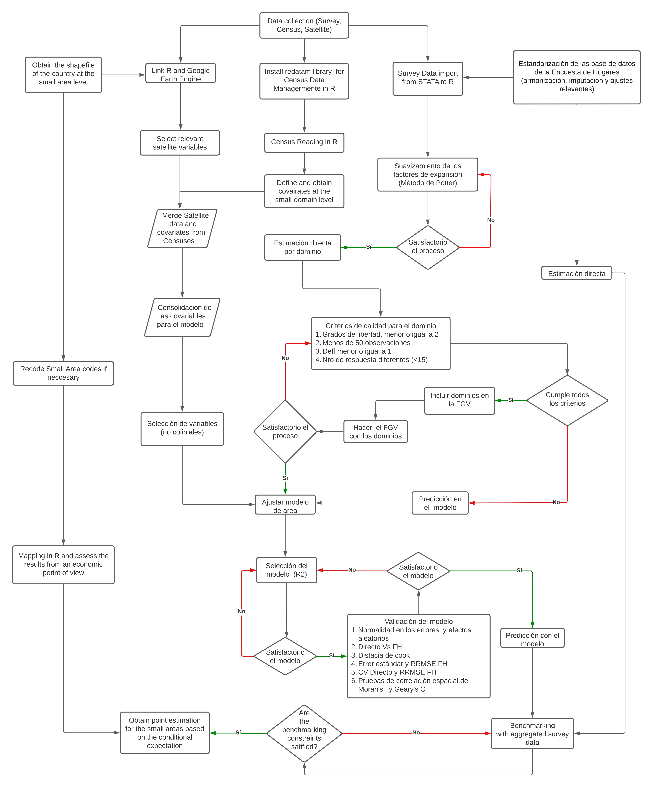

--- 
title: "Informe de resultados para República Dominicana"
author: "Andrés Gutiérrez^[Experto Regional en Estadísticas Sociales - Comisión Económica para América Latina y el Caribe (CEPAL) -  andres.gutierrez@cepal.org], Stalyn Guerrero^[Consultor - Comisión Económica para América Latina y el Caribe (CEPAL), guerrerostalyn@gmail.com]"
date: "2023-03-09"
documentclass: book
# bibliography: [CEPAL.bib]
biblio-style: apalike
link-citations: yes
colorlinks: yes
lot: yes
lof: yes
fontsize: 12pt
geometry: margin = 3cm
header-includes: \usepackage[spanish, spanishkw, onelanguage, linesnumbered]{algorithm2e}
github-repo: psirusteam/HHS-Handbook
description: "Documentos con la descripción del proceso de compilación en **R**."
knit: "bookdown::render_book"
lang: es
linkcolor: blue
output:
  pdf_document:
    toc: true
    toc_depth: 3
    keep_tex: true
    latex_engine: xelatex
  gitbook:
    df_print: kable
    css: "style.css"
---

# Prefacio {-}

La versión online de este documento está licenciada bajo una [Licencia Internacional de Creative Commons para compartir con atribución no comercial 4.0](http://creativecommons.org/licenses/by-nc-sa/4.0/). 

El diagrama del flujo de trabajo seguido para implementar la metodología es la siguiente.  

